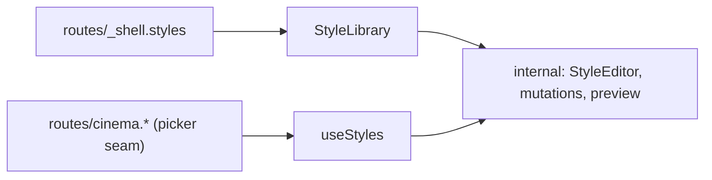

# index.ts — AI component doc

> AI-facing sidecar for `index.ts`. Created 2026-07-31. Keep this in sync with the code on every change.

## Purpose
Public API of the Styles module — the only surface routes may import. Deep
imports into `components/` or `model/` are an architecture violation.

## What it does (for an AI reader)
- Responsibilities: expose the page body and the registry read; keep everything
  else (the editor, the mutations, the preview run) module-internal.
- Public API / exports: `StyleLibrary`, type `StyleLibraryProps`, `useStyles`.
- Inputs → Outputs: n/a (a barrel).
- Side effects: none.

## Dependencies
- Imports / depends on: `./components/StyleLibrary`, `./model/api`.
- Used by: `routes/_shell.styles.tsx` (the page), and — for the picker migration
  — `routes/_shell.cinema.index.tsx` and `routes/cinema.$filmId.tsx`, which read
  `useStyles` and hand the list DOWN as props.

## Diagram

## Key decisions / gotchas
- **`useStyles` is exported but the mutations are NOT.** Other routes need to
  READ the registry to render a style picker; only this module's own screen may
  write to it. Exporting the writers would invite a second editor elsewhere.
- **No other MODULE imports this one.** Cinema's pickers are deep components, so
  the list reaches them as props from their route — the exact seam
  `cinema.$filmId.tsx` already uses for the catalog, templates and entities.

## Commits
- _no commit yet_
