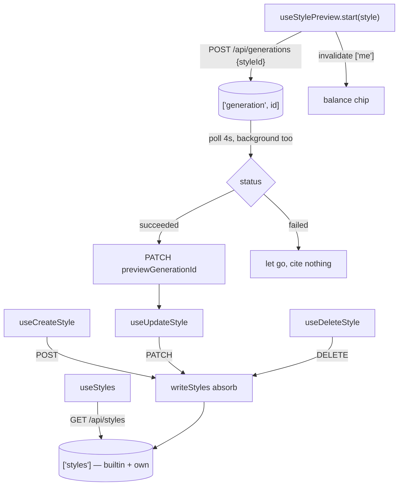

# api.ts — AI component doc

> AI-facing sidecar for `api.ts`. Created 2026-07-31. Keep this in sync with the code on every change.

## Purpose
The Style Studio's entire data layer: the ONE registry read every style picker in
the app renders from, the three owner-scoped writes, and the preview run. It
exists so no component touches `fetch` and no component decides when a preview is
finished.

## What it does (for an AI reader)
- Responsibilities: read `['styles']` (the server's union of the seven builtin
  styles and the caller's own rows); create/update/delete a user style and absorb
  the answer into that one cache; submit a preview generation, poll it, and cite
  the succeeded run on the style.
- Public API / exports: `STYLE_PREVIEW_PROMPT`, `PREVIEW_FALLBACK_MODEL_ID`,
  `useStyles()`, `useCreateStyle()`, `useUpdateStyle()`, `useDeleteStyle()`,
  `useStylePreview()`. Endpoints: `GET /api/styles`, `POST /api/styles`,
  `PATCH /api/styles/:id`, `DELETE /api/styles/:id`, plus `POST /api/generations`
  and `GET /api/generations/:id` for the preview.
- Inputs → Outputs: nothing → `StyleList` (builtin + own, `previewUrl` already
  resolved server-side); a `CreateStyleInput` → the created `Style`, appended to
  the cached list; a `Style` → a preview generation id, then a `previewGenerationId`
  citation on that style.
- Side effects (I/O, network, state): the six HTTP calls above; `setQueryData` on
  `['styles']` and on `['generation', id]`; `invalidateQueries(['me'])` after a
  preview submit (it spends credits); one `useState` holding the in-flight preview.

## Dependencies
- Imports / depends on: `react` (`useEffect`, `useState`), `@tanstack/react-query`,
  contract types (`Style`, `StyleList`, `CreateStyleInput`, `UpdateStyleInput`,
  `Generation`), `shared/libs/apiClient`.
- Used by: `components/StyleLibrary.tsx`, `components/StyleEditor.tsx`, and —
  through the module's `index.ts` — `routes/_shell.styles.tsx`,
  `routes/_shell.cinema.index.tsx` and `routes/cinema.$filmId.tsx` (the picker
  seam: routes read `useStyles` and hand the list down as props, because Cinema
  must not import Styles).

## Diagram

## Key decisions / gotchas
- **One key, two sources, no client inference.** `['styles']` holds builtins and
  user rows in the same shape; `builtin` on the row is the server's answer and the
  only thing that distinguishes them. Nothing here re-derives that from the id.
- **Writes absorb, they never invalidate.** Each write answers with the whole row
  it just wrote, so a refetch would discard it and add a round-trip at the moment
  the user is watching. `writeStyles` is the single writer of the cache.
- **An unloaded list is left alone.** `setQueryData` returning `old` when `old` is
  undefined stops a write from a surface that never rendered the list from
  fabricating a one-item registry that would flash and then be replaced.
- **A created style APPENDS.** The builtin seven lead the list server-side;
  prepending would reorder the row the user is reading.
- **`refetchIntervalInBackground: true` on the preview poll.** TanStack pauses
  interval refetches while the tab is hidden and this app disables
  `refetchOnWindowFocus` globally — together, a preview started and then tabbed
  away from spins forever. Same live finding as the Creator transcript poll
  (`modules/Creator/model/api.ts.md`, update 2026-07-30).
- **The preview cites, it never owns.** On success the style stores a
  `previewGenerationId`; the server resolves it to a `previewUrl` and degrades to
  null when the run is gone (ADR canvas-mode D1). A FAILED run cites nothing —
  the effect lets go without a PATCH.
- **`STYLE_PREVIEW_PROMPT` is deliberately styleless.** A figure, a place and a
  light source, with no aesthetic adjectives: the only difference between two
  previews must be the style's own fragment. A prompt that already said
  "cinematic" would flatter every style equally.
- **The success `useEffect` is a reaction to an external event**, not derived
  state — the provider finishing is not something a render can compute. It depends
  on `attach.mutate` (stable in TanStack v5), never the mutation object.
- **The effect never CLEARS the pending preview.** Clearing would be a `setState`
  inside an effect, which `react-hooks/set-state-in-effect` rejects (and which
  costs an extra render); `pendingStyleId` is DERIVED from the polled status
  instead. A settled `pending` is free — `refetchInterval` has already returned
  false, so the query is parked rather than looping. `isSettled` also treats "the
  id never answered" (`isError` with no data) as over, so a dead generation
  cannot spin a button forever.

## Commits
- _no commit yet_

## Update 2026-07-31 — the reference half of the package
- Adds `useAddStyleReference()` (`POST /api/styles/:id/references { dataUri }`) and
  `useDeleteStyleReference()` (`DELETE /api/styles/:id/references/:refId`), the two
  writes behind `StyleReferenceImages` (ADR style-studio A1/A4).
- Both answer with the WHOLE updated `Style`, so they absorb through the same
  `writeStyles` replace-in-place the field writes use — the thumb strip re-renders
  from the server's own row and nothing is merged client-side.
- A delete of an unknown `refId` answers 200 with the unchanged style rather than
  404, so a delete that races another tab is safe to fire and safe to absorb.
