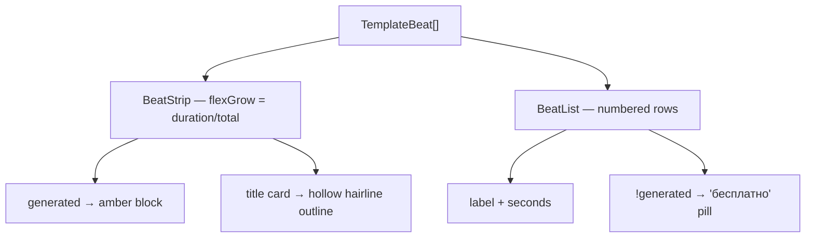

# BeatSheet.tsx — AI component doc

> AI-facing sidecar for `BeatSheet.tsx`. Created 2026-07-11. Keep this in sync with the code on every change.

## Purpose

A template's structure, drawn two ways: `BeatStrip` (the compact bar on a card) and
`BeatList` (the named, numbered list in the detail sheet). This is the closest thing the
gallery has to a preview, and it is doing real work — not decoration.

## What it does (for an AI reader)

- Responsibilities: turn `TemplateBeat[]` into a legible picture of the film's shape, and
  make the FREE beats visibly free.
- Public API / exports / props: `BeatStrip` + `BeatStripProps = { beats: TemplateBeat[] }`;
  `BeatList` + `BeatListProps = { beats: TemplateBeat[] }`.
- Inputs → Outputs: `TemplateBeat = { label, durationSeconds, generated }` → a
  proportional bar (strip) / an `<ol>` of named rows with a "бесплатно" pill (list).
- Side effects (I/O, network, state): none — pure presentational.

## Dependencies

- Imports / depends on: `@opencreate/contracts` (`TemplateBeat`), `react-i18next`
  (`BeatList` only).
- Used by: `TemplateCard` (`BeatStrip`), `TemplateDetailModal` (`BeatList`).

## Diagram

## Key decisions / gotchas

- **Why a shape and not a thumbnail.** We have no rendered example of a template yet
  (`previewUrl` is null), and a grey box pretending to be a video would be worse than
  nothing. A template's SHAPE is its most useful fact: "nine beats, the last one free,
  sixty-six seconds" tells you more about whether you want this than a thumbnail would —
  and the reader can literally see **which beats cost money**.
- **`BeatStrip` is `aria-hidden`.** It is a visual restatement of the beat count and total
  duration, both of which are announced as text right next to it; a screen reader walking
  nine unlabelled divs learns nothing. `BeatList` is the accessible form of the same data.
- **The hollow block / "бесплатно" pill is why the card can honestly say "9 битов" while
  the price only multiplies by 8** — a title card carries no generation (ffmpeg draws it
  over black at render).
- Keys are `label-index`, not the index alone: two beats can share a label ("Клиффхэнгер")
  across templates, and index-only keys are banned in this codebase.

## Commits

- _no commit yet_
