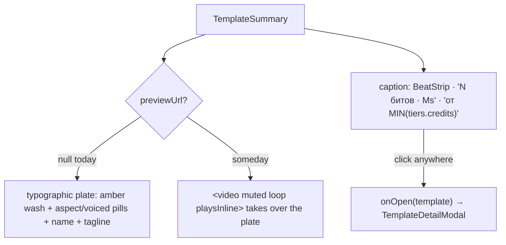

# TemplateCard.tsx — AI component doc

> AI-facing sidecar for `TemplateCard.tsx`. Created 2026-07-11. Keep this in sync with the code on every change.

## Purpose

One template in the gallery grid: a typographic "poster" plate plus a caption row that
states the film's shape and its cheapest price. The whole card is one button that opens
the detail sheet.

## What it does (for an AI reader)

- Responsibilities: pitch one format honestly, without a fake preview.
- Public API / exports / props: `TemplateCard`, `TemplateCardProps = { template:
  TemplateSummary; onOpen: (template) => void }`.
- Inputs → Outputs: a `TemplateSummary` → the poster (aspect pill, "voiced" pill, name,
  tagline), the `BeatStrip`, and `от N кредитов` computed as the **min** over
  `template.tiers`.
- Side effects (I/O, network, state): none — `onOpen` is the only output. The caller owns
  the modal.

## Dependencies

- Imports / depends on: `react-i18next`, `@opencreate/contracts` (`TemplateSummary`),
  `shared/ui` (`Card`), `./BeatSheet` (`BeatStrip`).
- Used by: `TemplateCatalog`.

## Diagram

## Key decisions / gotchas

- **THE HONEST-POSTER PROBLEM.** This product is media-first and a catalog of video
  templates with no video on the cards is a bad hand. The tempting move — a grey
  placeholder box, or a stock gradient with a play triangle — is a lie: it promises a
  preview and delivers a rectangle, and the user learns the cards are noise. So the poster
  is **typographic, and every mark on it is information**: the tagline is the format's
  premise in one line (the actual pitch); the beat strip is the film's real shape, with the
  free beats visibly hollow; the price shown is the **cheapest** tier, because that is the
  number that decides whether someone even opens the card.
- **The `previewUrl` seam is already wired.** When a real render of a template lands, the
  `<video>` takes over the plate and all of the above becomes the caption. Nothing else
  changes.
- **The plate is 4:5, not the true 9:16 of the output.** A real 9:16 poster in a
  four-across grid is a column of slivers. 4:5 still reads as vertical without making the
  grid unusable, and the actual aspect ratio is stated in the meta pill.
- The amber wash is **not decoration**: it ties the card to the amber "generated beat"
  language used by `BeatStrip` and the tier pills.

## Commits

- _no commit yet_
