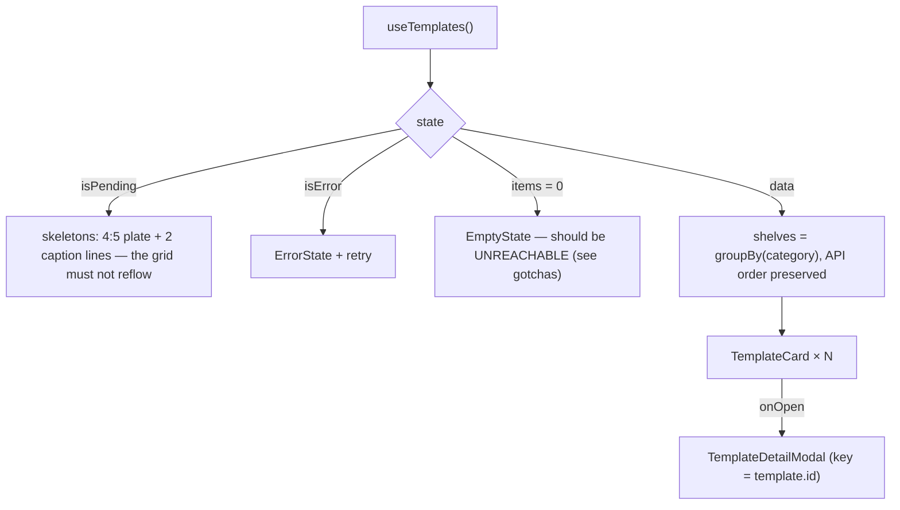

# TemplateCatalog.tsx — AI component doc

> AI-facing sidecar for `TemplateCatalog.tsx`. Created 2026-07-11. Keep this in sync with the code on every change.

## Purpose

The `/templates` page body: the gallery of ready-made viral formats, grouped into
category shelves, with the detail sheet hanging off it.
ADR: `docs/wiki/decisions/template-catalog.md`.

## What it does (for an AI reader)

- Responsibilities: the full 4-states rule (loading skeletons → error+retry → empty →
  grid), grouping by `category`, and owning the ONE piece of page state — which template's
  sheet is open.
- Public API / exports / props: `TemplateCatalog` — **no props**. It reads its own data.
- Inputs → Outputs: `useTemplates()` → shelves of `TemplateCard`s + one
  `TemplateDetailModal`.
- Side effects (I/O, network, state): the `['templates']` query (via `useTemplates`);
  local `openTemplate` state.

## Dependencies

- Imports / depends on: `react` (`useMemo`, `useState`), `react-i18next`,
  `@opencreate/contracts` (`TemplateCategory`, `TemplateSummary`), `shared/ui`
  (`EmptyState`, `ErrorState`, `Skeleton`), `../model/templatesApi` (`useTemplates`),
  `./TemplateCard`, `./TemplateDetailModal`.
- Used by: `modules/Templates/index.ts` → `routes/_shell.templates.index.tsx`.

## Diagram

## Key decisions / gotchas

- **The empty state should be UNREACHABLE.** The catalog is a server-side constant, so
  "no templates" means an API deploy shipped an empty registry. It is rendered honestly
  rather than as a crash — but it is a bug report, not a user's normal path.
- **Shelves exist from day one even though there is only one category.** With a single
  `brainrot` category the grouping looks like overhead; it is not. The whole point of the
  module is that it grows, and a flat grid of forty templates is a wall. Grouping now means
  the second shelf is data, not a rewrite. The heading is **skipped when there is only one
  shelf** — a lone "Брейнрот" header above every card on the page is noise.
- **API order is preserved within a shelf.** It is curated (see `catalog/index.ts`): the
  dramas lead because they are why anyone opens this page.
- **The modal is keyed by `template.id`**, so opening a different template re-initialises
  its form draft — the same no-`useEffect`-syncing-props-into-state discipline as
  `ShotInspector`. The `'none'` fallback key keeps React happy while it is closed.
- The skeleton mirrors the real card's silhouette (a 4:5 plate plus two caption lines)
  precisely so the grid does not reflow when the data lands.

## Commits

- _no commit yet_
