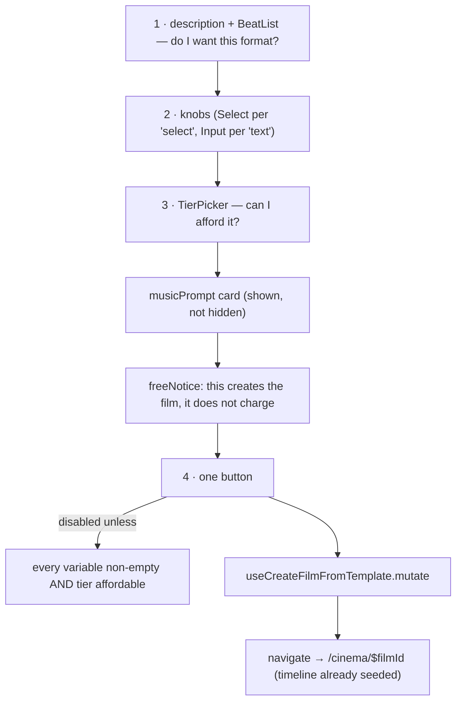

# TemplateDetailModal.tsx — AI component doc

> AI-facing sidecar for `TemplateDetailModal.tsx`. Created 2026-07-11. Keep this in sync with the code on every change.

## Purpose

The commit surface: read what a template IS, turn its knobs, pick a price tier, and land
in the Cinema editor with a built timeline.

## What it does (for an AI reader)

- Responsibilities: hold the knob draft + the chosen tier, gate the button, fire the
  instantiate mutation and navigate into the new film.
- Public API / exports / props: `TemplateDetailModal`, `TemplateDetailModalProps =
  { template: TemplateSummary | null; onClose: () => void }` — **`null` = closed**.
- Inputs → Outputs: `{ templateId, tier, variables }` → `POST /api/films/from-template` →
  `navigate({ to: '/cinema/$filmId' })`.
- Side effects (I/O, network, state): `useCreateFilmFromTemplate` (the POST + the cache
  seed/invalidate), `useBalance` (`['me']`), `useNavigate`; local `values` + `tier` state.

## Dependencies

- Imports / depends on: `react`, `react-i18next`, `@tanstack/react-router` (`useNavigate`),
  `@opencreate/contracts` (`TemplateSummary`, `TemplateTier`), `shared/ui` (`Button`,
  `Card`, `ErrorState`, `Input`, `Modal`, `Select`), `../model/templatesApi`,
  `./BeatSheet` (`BeatList`), `./TierPicker`.
- Used by: `TemplateCatalog` (keyed by `template.id`).

## Diagram

## Key decisions / gotchas

- **The order of the sheet IS the order of the decision**: what this format is (1) → the
  knobs, do I want THIS one (2) → the price, can I have it (3) → one button (4).
- **WHAT THE BUTTON DOES NOT DO: spend money.** Instantiating writes a film and N draft
  shots and charges **zero credits**. The tier is a *pin*, not a purchase — it decides
  which model each shot will use WHEN the user later generates it, one beat at a time,
  having seen the prompt. `templates.detail.freeNotice` under the button says so, because a
  screen that shows a 1120-credit number next to a big amber button is otherwise asking to
  be misread.
- **The form is seeded from every variable's `defaultValue`**, so the sheet opens on a
  valid, generatable film — the user may press Create without touching a thing.
- **No `useEffect` syncing props into state.** The parent keys this component by
  `template.id`, so a fresh sheet always holds a fresh draft (the same discipline as
  `ShotInspector`).
- **`isComplete` guards the free-text knob**: an empty text value would be substituted as
  an empty line into a spoken beat. The server rejects it — but the button should never
  have been live.
- **`canAfford` is `true` while the balance is loading** (`balance.data === undefined`).
  A slow `/api/me` must never make the product look out of stock.
- **The template's `musicPrompt` is shown, not hidden**, because it is pre-filled into the
  editor's audio panel and the user should not be surprised to find it there.

## Commits

- _no commit yet_
