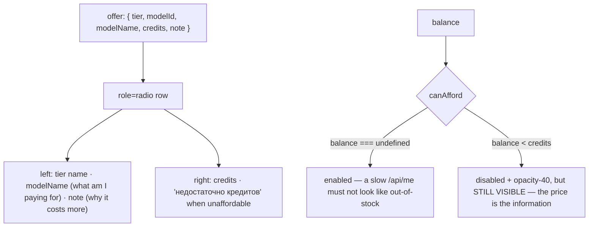

# TierPicker.tsx — AI component doc

> AI-facing sidecar for `TierPicker.tsx`. Created 2026-07-11. Keep this in sync with the code on every change.

## Purpose

The price/quality choice (draft · standard · premium) — the single most consequential
control in the Templates module, rendered as a `radiogroup` of rows rather than a
`PillGroup`.

## What it does (for an AI reader)

- Responsibilities: show all three offers with their model, price and reason-to-pay; mark
  the ones the caller cannot afford; report the selection up.
- Public API / exports / props: `TierPicker`, `TierPickerProps = { offers:
  TemplateTierOffer[]; value: TemplateTier; onChange: (tier) => void; balance: number |
  undefined }`.
- Inputs → Outputs: `TemplateTierOffer[]` (from `TemplateSummary.tiers`, priced
  server-side from the live catalog) → `onChange(tier)`.
- Side effects (I/O, network, state): none — fully controlled.

## Dependencies

- Imports / depends on: `react-i18next`, `@opencreate/contracts` (`TemplateTier`,
  `TemplateTierOffer`).
- Used by: `TemplateDetailModal`.

## Diagram

## Key decisions / gotchas

- **This is not a `PillGroup`, and that is the whole point.** A pill holds one label. This
  choice needs four facts per option (tier name, model, credits, and what the tier buys you
  that the cheaper one doesn't) and one of them — *can you actually afford this?* — has to
  be answered BEFORE the click, not after. A template runs 448–1120 credits: a user who
  picks premium with 300 credits in the bank would build a nine-shot film they cannot
  generate a single beat of, and would find out one shot at a time.
- **Unaffordable tiers stay visible.** Disabled, dimmed, and labelled with why — but shown,
  because the price IS the information.
- **`balance === undefined` disables nothing.** While `/api/me` is in flight every tier
  stays live.
- **The model name is shown deliberately**: it is the honest answer to "what am I paying
  for". `offer.note` is the answer when the number alone doesn't say it — on premium it is
  "персонажи говорят сами", which is the reason the format works, not an upsell.
- The shared amber selection tint and the hairline/ridge hover of `PillGroup` are preserved
  so it still reads as part of the same kit.

## Commits

- _no commit yet_
