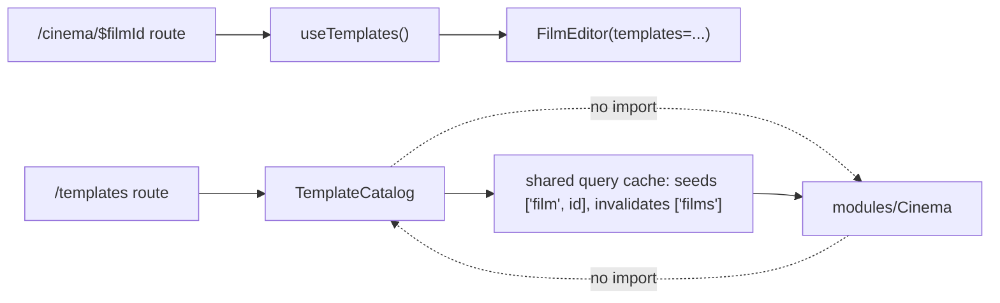

# index.ts — AI component doc

> AI-facing sidecar for `index.ts`. Created 2026-07-11. Keep this in sync with the code on every change.

## Purpose

Public API of the Templates module — routes import ONLY from `modules/Templates`;
`model/` and `components/` are private. ADR: `docs/wiki/decisions/template-catalog.md`.

## What it does (for an AI reader)

- Responsibilities: define the module boundary. Nothing else.
- Public API / exports: `TemplateCatalog` (the /templates page body), `useTemplates`
  (the gallery query), `useTemplate(templateId)` (a single summary out of the list
  cache).
- Inputs → Outputs: n/a — re-exports.
- Side effects (I/O, network, state): none.

## Dependencies

- Imports / depends on: `./components/TemplateCatalog`, `./model/templatesApi`.
- Used by: `routes/_shell.templates.index.tsx` (`TemplateCatalog`),
  `routes/_shell.cinema.$filmId.tsx` (`useTemplates`).

## Diagram

## Key decisions / gotchas

- **Templates does NOT import Cinema, and Cinema does not import Templates.** They meet
  in two places, both of them seams the codebase already uses:
  1. a **ROUTE**. `/templates` creates a film and then navigates to `/cinema/$filmId`.
     `useTemplate` is exported (the Entities module's precedent, which exports
     `useEntities` for exactly this reason) so the film-editor route can look up the
     template a film came from and hand its music prompt to `FilmEditor` — without
     either module importing the other.
  2. the shared **QUERY CACHE**. Instantiation seeds `['film', id]` and invalidates
     `['films']`; Cinema reads both. No import, no coupling.
- `useCreateFilmFromTemplate` and `useBalance` are deliberately NOT exported — they are
  internal to the detail modal. Only what a route needs crosses the boundary.

## Commits

- _no commit yet_
