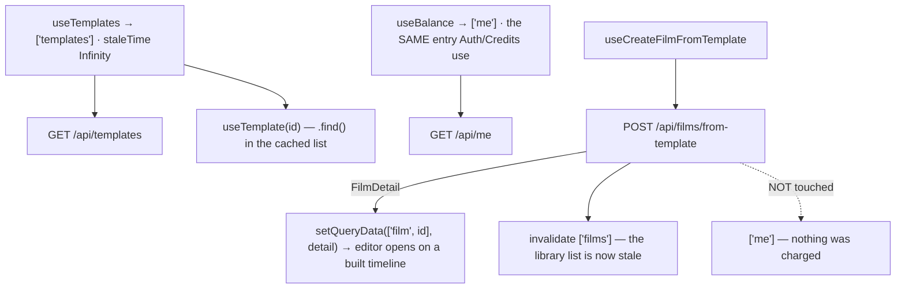

# templatesApi.ts — AI component doc

> AI-facing sidecar for `templatesApi.ts`. Created 2026-07-11. Keep this in sync with the code on every change.

## Purpose

Server state for the template catalog: read the gallery, look one template up, read the
caller's balance, and instantiate a film from a template.
ADR: `docs/wiki/decisions/template-catalog.md`.

## What it does (for an AI reader)

- Responsibilities: own every TanStack Query/Mutation this module talks to the API with,
  and the cache writes that follow a successful instantiation.
- Public API / exports:
  - `useTemplates()` → `useQuery(['templates'])` → `GET /api/templates`, `staleTime: Infinity`.
  - `useTemplate(templateId | null)` → a `TemplateSummary | undefined` read out of the
    list cache (a lookup, NOT a second request).
  - `useCreateFilmFromTemplate()` → `useMutation` → `POST /api/films/from-template`.
  - `useBalance()` → `useQuery(['me'])`, `staleTime: 30s`; `type Me = { creditsBalance: number }`.
- Inputs → Outputs: `CreateFilmFromTemplateInput` → `FilmDetail` (the built film, with
  its shots).
- Side effects (I/O, network, state): two GETs and one POST; on POST success it **seeds**
  `['film', detail.film.id]` and **invalidates** `['films']`.

## Dependencies

- Imports / depends on: `@tanstack/react-query`, `@opencreate/contracts`
  (`CreateFilmFromTemplateInput`, `FilmDetail`, `TemplateList`, `TemplateSummary`),
  `shared/libs/apiClient` (`api`).
- Used by: `components/TemplateCatalog` (`useTemplates`),
  `components/TemplateDetailModal` (`useCreateFilmFromTemplate`, `useBalance`),
  `routes/_shell.cinema.$filmId.tsx` via the module's `index.ts` (`useTemplates`),
  `FilmEditor` indirectly (it receives the list as a prop).

## Diagram

## Key decisions / gotchas

- **`['templates']` is `staleTime: Infinity`.** Like `['catalog']`, it is computed from
  two in-process SERVER constants (the template registry × the model catalog) and changes
  only with an API deploy — so: one fetch per session, no refetch, and no cards reordering
  under a user who is mid-decision.
- **The POST response is SEEDED, not invalidated.** The endpoint returns the full
  `FilmDetail`, and the user is about to be navigated into that editor: seeding
  `['film', id]` means they land on a built timeline instead of a skeleton that resolves a
  moment later.
- **`['me']` is deliberately NOT invalidated after instantiation.** Nothing was charged —
  applying a template is free. Refreshing the balance here would make the action *look*
  like it cost something.
- **`useBalance` reads the SAME `['me']` cache entry Auth and Credits use** — the
  established cross-module seam in this codebase is a shared cache key, never an import.
  The detail modal needs it to say "you cannot afford this tier" BEFORE the user commits,
  rather than letting them build a film they cannot generate a single beat of.
- `useTemplate` returns `undefined` both for a hand-made film (`templateId === null`) and
  while `['templates']` is still in flight — callers must treat both as "no template", and
  `FilmEditor` does.

## Commits

- _no commit yet_
