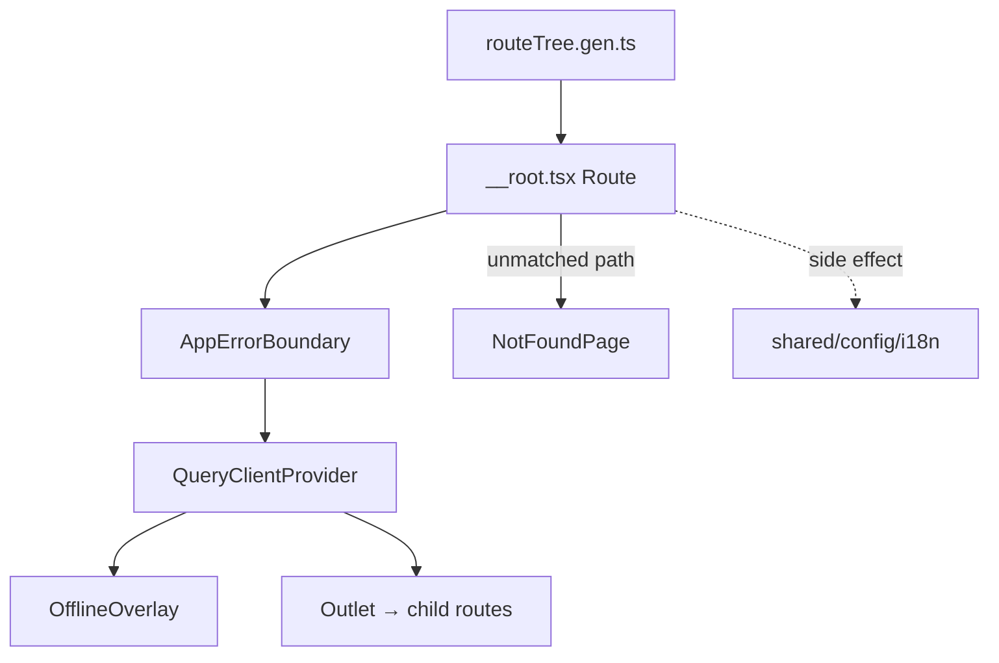

# __root.tsx — AI component doc

> AI-facing sidecar for `__root.tsx`. Created 2026-07-06. Keep this in sync with the code on every change.

## Purpose
TanStack Router root route — the provider shell around every screen: TanStack Query cache, i18n side-effect init, and (from Task 13) the global error-UX surfaces (crash boundary, offline overlay, 404).

## What it does (for an AI reader)
- Responsibilities: `createRootRoute` with a `RootLayout` that nests `AppErrorBoundary` → `QueryClientProvider` → (`OfflineOverlay` + `<Outlet />`); registers `notFoundComponent: NotFoundPage`; imports `shared/config/i18n` for its side effect so translations exist before any child renders.
- Public API / exports: `Route` (consumed by the generated `routeTree.gen.ts`).
- Inputs → Outputs: child route matches → rendered inside global providers and error-UX surfaces; unmatched paths → custom 404.
- Side effects: i18next initialization at module load.

## Dependencies
- Imports / depends on: `@tanstack/react-router`, `@tanstack/react-query`, `shared/config/queryClient`, `shared/config/i18n`, `shared/ui` (`AppErrorBoundary`, `OfflineOverlay`, `NotFoundPage`).
- Used by: `routeTree.gen.ts` (root of the generated tree) → `main.tsx` router.

## Diagram

## Key decisions / gotchas
- Routes stay composition-only (no business logic) per the frontend standard.
- `AppErrorBoundary` is OUTSIDE the providers on purpose: even a provider crash still shows the calm fallback (the fallback depends only on i18next's global instance).
- `OfflineOverlay` renders as a sibling of `<Outlet />` at `z-[60]`, so it blocks any screen and any open modal.

## Commits
- c987d5f 2026-07-06 feat(web): vite scaffold, tanstack router, i18n, providers
- 51d80a6 2026-07-06 feat(web): paper&ink design system, shared ui kit, error-ux surfaces
