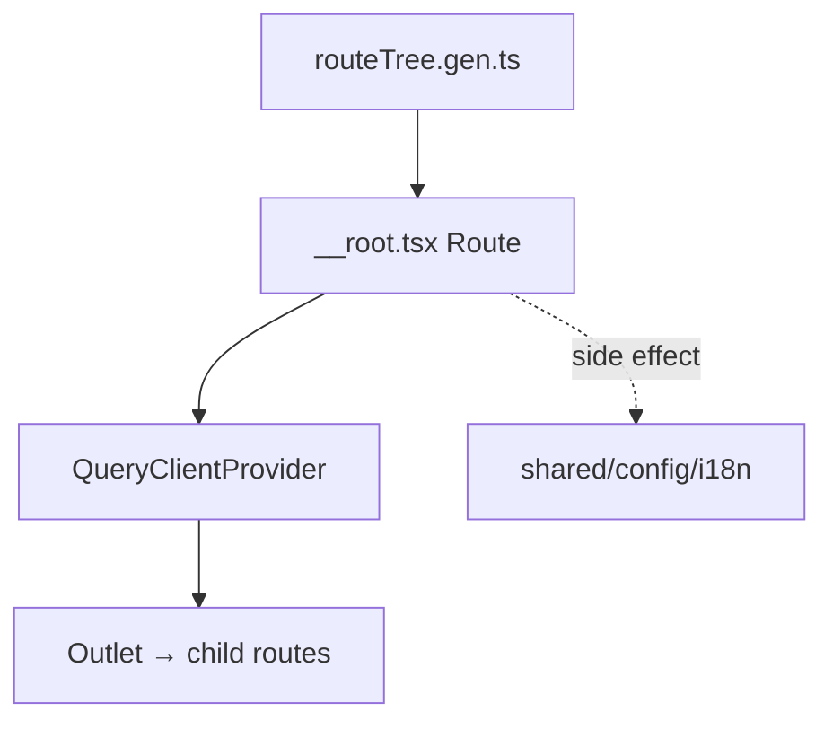

# __root.tsx — AI component doc

> AI-facing sidecar for `__root.tsx`. Created 2026-07-06. Keep this in sync with the code on every change.

## Purpose
TanStack Router root route — the provider shell around every screen: TanStack Query cache, i18n side-effect init, and (from Task 13) the global error-UX surfaces (crash boundary, offline overlay, 404).

## What it does (for an AI reader)
- Responsibilities: `createRootRoute` with a `RootLayout` component that mounts `QueryClientProvider` around `<Outlet />`; imports `shared/config/i18n` for its side effect so translations exist before any child renders.
- Public API / exports: `Route` (consumed by the generated `routeTree.gen.ts`).
- Inputs → Outputs: child route matches → rendered inside global providers.
- Side effects: i18next initialization at module load.

## Dependencies
- Imports / depends on: `@tanstack/react-router`, `@tanstack/react-query`, `shared/config/queryClient`, `shared/config/i18n`; Task 13 adds `shared/ui` (`AppErrorBoundary`, `OfflineOverlay`, `NotFoundPage`).
- Used by: `routeTree.gen.ts` (root of the generated tree) → `main.tsx` router.

## Diagram

## Key decisions / gotchas
- Routes stay composition-only (no business logic) per the frontend standard.
- Task 12 ships providers only; Task 13 wraps this layout with `AppErrorBoundary`, adds `OfflineOverlay` and `notFoundComponent: NotFoundPage` — done in two steps so each commit stays green.

## Commits
- _no commit yet_
