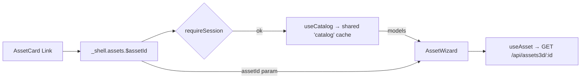

# _shell.assets.$assetId.tsx — AI component doc

> AI-facing sidecar for `_shell.assets.$assetId.tsx`. Created 2026-07-20. Keep this in sync with the code on every change.

## Purpose
The `/assets/:assetId` screen — the Modular 3D Assets wizard. Auth-guarded
composition **plus the cross-module catalog SEAM**: it reads the catalog here and
hands it to `AssetWizard` as `models`, so the Assets3D module never imports Generator.

## What it does (for an AI reader)
- Responsibilities: declare the file route `/_shell/assets/$assetId`, guard it with
  `requireSession()`, read `useCatalog()`, render the tighter workbench canvas and
  mount `<AssetWizard assetId models />`.
- Public API / exports / props / endpoints: `Route` (TanStack file route).
  Reads `GET /api/catalog` via the shared `['catalog']` cache entry.
- Inputs → Outputs: the `assetId` route param + the catalog models → the wizard.
- Side effects (I/O, network, state): the `requireSession()` guard; the catalog query
  (shared, one fetch per session). It deliberately does **not** load the asset.

## Dependencies
- Imports / depends on: `@tanstack/react-router` (`createFileRoute`), `modules/Auth`
  (`requireSession`), `modules/Assets3D` (`AssetWizard`), `modules/Generator`
  (`useCatalog`).
- Used by: `routeTree.gen.ts` (generated) and `AssetCard`'s typed `<Link>`.

## Diagram

## Key decisions / gotchas
- **This route IS the cross-module seam.** Assets3D must not import Generator, and the
  extraction / mesh-tier PRICES come from the catalog — so the catalog is read here and
  passed down as a `models` prop, exactly as `/cinema/$filmId` feeds `FilmEditor` and
  `/soul/$entityId` feeds `SoulCard`.
- **An empty `models` array is a normal state, never an error.** While `['catalog']` is
  in flight the paid stages pulse a skeleton price and stay disabled rather than quote a
  number nothing backs.
- **The route does NOT load the asset aggregate.** `AssetWizard` owns `useAsset` because
  it is the component that renders all four of its states; splitting the query from its
  states across two files is how loading/error handling drifts.
- Canvas gutters are the tighter workbench posture (`px-4 py-4 xl:px-6`, the
  `/cinema/$filmId` precedent), not the browsing-screen rhythm — the chrome budget goes
  to the stage.

## Commits
- _no commit yet_
