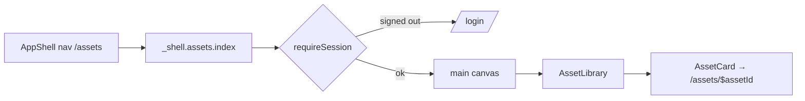

# _shell.assets.index.tsx — AI component doc

> AI-facing sidecar for `_shell.assets.index.tsx`. Created 2026-07-20. Keep this in sync with the code on every change.

## Purpose
The `/assets` screen — the Modular 3D Assets library. Auth-guarded composition only:
it lays out the full-bleed page canvas and mounts `<AssetLibrary/>`.

## What it does (for an AI reader)
- Responsibilities: declare the file route `/_shell/assets/`, bounce signed-out
  visitors in `beforeLoad`, render the `<main>` canvas.
- Public API / exports / props / endpoints: `Route` (TanStack file route). No props.
  No direct endpoints — the module owns every query and mutation.
- Inputs → Outputs: a navigation to `/assets` → the library screen inside the
  `_shell` layout (AppShell chrome).
- Side effects (I/O, network, state): the `requireSession()` guard (may redirect);
  nothing else.

## Dependencies
- Imports / depends on: `@tanstack/react-router` (`createFileRoute`), `modules/Auth`
  (`requireSession`), `modules/Assets3D` (`AssetLibrary`).
- Used by: `routeTree.gen.ts` (generated by the Vite router plugin — never hand-edited)
  and the `/assets` nav link in `shared/ui/AppShell.tsx`.

## Diagram

## Key decisions / gotchas
- **Composition only.** The list query, the create modal and every mutation live in
  `modules/Assets3D`; a route that fetched would duplicate state the module already
  owns and split its 4 UI states across two files.
- Canvas gutters match `/cinema` and `/library` (`px-6 py-8 xl:px-10`) so the browsing
  screens share one rhythm — the wizard route deliberately uses a tighter one.
- The route path is `/_shell/assets/` (the pathless layout route supplies AppShell);
  `routeTree.gen.ts` is regenerated by the Vite plugin, never edited by hand.

## Commits
- _no commit yet_
