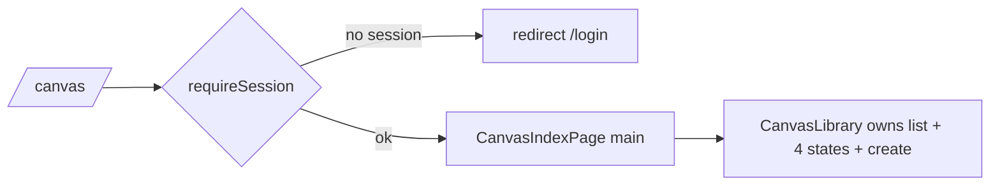

# _shell.canvas.index.tsx — AI component doc

> AI-facing sidecar for `_shell.canvas.index.tsx`. Created 2026-07-30. Keep this in sync with the code on every change.

## Purpose
The `/canvas` route: the canvas list, inside the global AppShell. Auth-guarded and composition-only — it lays out the page canvas and hands the screen to `CanvasLibrary`, exactly like `_shell.cinema.index.tsx` does for films.

## What it does (for an AI reader)
- Responsibilities: declare the route, guard it, provide the page frame.
- Public API / exports / props / endpoints: `Route` (`/_shell/canvas/`), guarded by `beforeLoad: requireSession`.
- Inputs → Outputs: a URL → the list screen, or a redirect to `/login` for signed-out visitors.
- Side effects (I/O, network, state): the session check in `beforeLoad`; all data fetching lives in the module.

## Dependencies
- Imports / depends on: `@tanstack/react-router`, `requireSession` from `modules/Auth`, `CanvasLibrary` from `modules/Canvas`.
- Used by: the generated `routeTree.gen.ts`; reachable from the AppShell nav ("Canvas").

## Diagram

## Key decisions / gotchas
- `_shell.` prefix keeps the app chrome: the list is a normal app screen, unlike the editor (`canvas.$canvasId.tsx`), which drops the shell to own the viewport.
- The guard runs BEFORE the screen mounts, so there is no flash of private UI.
- No business logic here on purpose — a route is a composition seam. Everything stateful belongs to `modules/Canvas`.

## Commits
- bcb3148 2026-07-30 feat(canvas-web): editor shell, palette, library, routes
