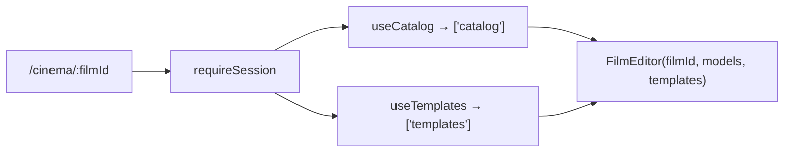

# _shell.cinema.$filmId.tsx — AI component doc

> AI-facing sidecar for `_shell.cinema.$filmId.tsx`. Created 2026-07-09. Keep this in sync with the code on every change.

## Purpose

The `/cinema/:filmId` editor route — auth-guarded, composition + TWO cross-module
SEAMS: it reads the catalog via the Generator's public `useCatalog` and the template
list via the Templates module's public `useTemplates`, and passes both into
`FilmEditor` as `models` and `templates`.

## What it does (for an AI reader)

- Responsibilities: route wiring, read the `filmId` param, feed the catalog and the
  template list in.
- Public API / exports: `Route` (TanStack file route `/_shell/cinema/$filmId`).
- Inputs → Outputs: `filmId` param + catalog + templates → the editor page.
- Side effects: `beforeLoad: requireSession()`; `useCatalog` and `useTemplates`
  queries (both shared cache entries — neither costs a fetch if another screen
  already loaded it).

## Dependencies

- Imports: `@tanstack/react-router` (`createFileRoute`), `requireSession` from
  `modules/Auth`, `FilmEditor` from `modules/Cinema`, `useCatalog` from
  `modules/Generator`, `useTemplates` from `modules/Templates`.
- Used by: the generated route tree (FilmCard `Link`, create-film navigate, and the
  navigate at the end of a template instantiation).

## Diagram

## Key decisions / gotchas

- The Cinema module must NOT import Generator; the route is the seam that reads
  `useCatalog` and passes `models` down — exactly like /create feeds Gallery/Generator.
- Same `['catalog']` cache entry the composer uses — one fetch per session.

## Key decisions (2026-07-11) — template catalog

- **`useTemplates()` is the SECOND seam, and it has exactly the same shape as the
  first.** A film made from a template carries its `templateId`, and the template
  knows what music the format wants — which pre-fills the audio panel. Cinema must not
  import Templates, so the list is read HERE and handed down.
- **`FilmEditor` does the lookup, not this route**, because the route does not load
  the film — the editor does. So the route passes the whole list, not a resolved
  template.
- `['templates']` is `staleTime: Infinity` and shared with `/templates`, so this costs
  nothing on a second visit, and `templates.data?.items ?? []` means an in-flight query
  simply reads as "no template" (the audio panel opens empty, exactly as it did before
  templates existed).

## Commits

- _no commit yet_
