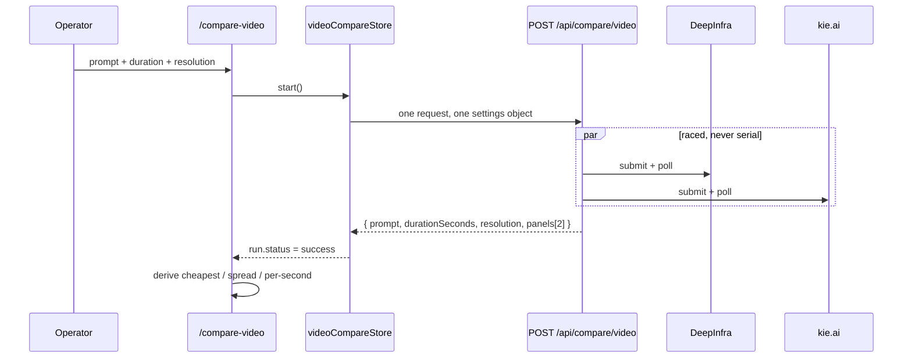

# _shell.compare-video.tsx — Seedance 2.0 cost receipt page

> AI-facing sidecar for `_shell.compare-video.tsx`. Created 2026-07-30. Keep this in sync with the code on every change.

## Purpose

Hidden operator page at `/compare-video` (inside the AppShell layout, NOT linked
from navigation). Runs ONE prompt through Seedance 2.0 on **two channels at once**
— DeepInfra and kie.ai — at byte-identical settings, and shows what each provider
actually billed for that exact job.

It exists because rate cards kept producing confident wrong answers, via two traps:

1. **Two columns per resolution.** Every vendor publishes "with video input"
   (billed over input+output duration) and "no video input" (output only). The
   product always sends text or an image, never a video, so it is always on the
   dearer no-video row — while comparison articles quote the cheaper one.
2. **Incomparable discount baselines.** kie.ai advertises ~−32%, measured against
   *fal*; DeepInfra resells *ByteDance*'s own list, and fal is roughly 2×
   ByteDance. Two discounts against different baselines cannot be compared.

The page replaces that arithmetic with two receipts.

## What it does (for an AI reader)

- Responsibilities: composition ONLY — form controls, the 4 UI states, and the
  cross-panel derivations (cheapest channel, spread, per-second cost). All
  behaviour lives in `modules/Compare`.
- Public API / exports: `Route` via `createFileRoute('/_shell/compare-video')`.
  Nothing else may be exported or the router plugin cannot code-split the screen.
- Inputs → Outputs: store state (`prompt`, `durationSeconds`, `resolution`, `run`)
  → a two-column grid of `VideoCostPanel`.
- Side effects: `start()` issues `POST /api/compare/video`, which SPENDS REAL
  PROVIDER MONEY and deliberately bypasses the credit ledger. Unmount aborts the
  request only.

## Dependencies

- Imports / depends on: `modules/Compare` (`useVideoCompareStore`,
  `VideoCostPanel`, `VIDEO_DURATIONS`, `VIDEO_RESOLUTIONS`), `shared/ui`
  (`Button`), `@tanstack/react-router`.
- Used by: `routeTree.gen.ts` (generated) — reached by direct URL only.
- Backed by: `POST /api/compare/video` in `apps/api/src/modules/compare/routes.ts`.

## Diagram

## Key decisions / gotchas

- **One request, not two.** The server builds the submit input ONCE and races the
  pipes itself. Two browser requests would let the form change mid-flight and
  produce a receipt whose halves priced different jobs.
- **No rate cards in the UI.** `costUsd: null` renders as "провайдер не назвал
  сумму", never as an estimate. Substituting a rate card for a missing receipt is
  the exact failure this page was built to kill.
- **`isCheapest` only among panels that SUCCEEDED and stated a figure.** A failed
  channel is not free, and a silent one is not cheapest.
- **The elapsed stopwatch is load-bearing**, not decoration: a real render is
  60-180s, and without a ticking number an operator reads the page as hung and
  reloads — abandoning a job that keeps billing.
- **Leaving the page does not stop the money.** Unmount aborts the HTTP request;
  the providers keep rendering and keep charging. The UI says so out loud.
- **Defaults are the cheapest real configuration** (5s / 720p): the catalog pins
  Seedance 2.0 to 720p, and a page whose default run costs $2.50 is one nobody
  presses twice.
- **kie.ai needs `KIE_API_KEY`.** Unset → that panel renders the actionable
  "not configured (KIE_API_KEY unset)" error and the DeepInfra half still measures.

## Commits

- _no commit yet_
