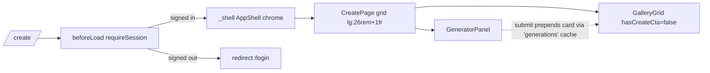

# _shell.create.tsx — AI component doc

> AI-facing sidecar for `_shell.create.tsx` (formerly `create.tsx`). Created 2026-07-06. Keep this in sync with the code on every change.

## Purpose

The `/create` route: auth-guarded generation screen composing the Generator
panel and the live Gallery column. Lives under the pathless `_shell` layout
since Task 18, so it renders inside the AppShell chrome (URL unchanged).

## What it does (for an AI reader)

- Responsibilities: route registration (`/_shell/create` → URL `/create`),
  `beforeLoad` auth guard, page layout. Composition only — no business logic
  (modular-architecture rule for routes/).
- Public API / exports: `Route` (TanStack file-route).
- Inputs → Outputs: navigation to `/create` → guard check → two-column render
  (GeneratorPanel left, live `GalleryGrid hasCreateCta=false` right; mobile stacks);
  signed-out → thrown redirect to `/login`.
- Side effects: `requireSession()` performs a session fetch in `beforeLoad`.

## Dependencies

- Imports: `@tanstack/react-router`, `react-i18next`, `modules/Auth` (`requireSession`),
  `modules/Generator` (`GeneratorPanel`), `modules/Gallery` (`GalleryGrid`).
- Used by: `routeTree.gen.ts` (generated, as child of `_shell.tsx`), `main.tsx` router.

## Diagram

## Key decisions / gotchas

- Guard in `beforeLoad`, not in the component: no flash of the private screen,
  no wasted catalog fetch for signed-out visitors.
- Task 18 moved the file under the `_shell` pathless layout: the shell now owns
  the page canvas (`bg-paper` + min-height + header), so the old
  `min-h-screen bg-paper` wrapper was removed from this screen — keeping it
  would double the viewport height under the header.

- v3 terminal restyle: page opener obeys the heading law — `text-3xl font-normal
  text-white` h1 (mono 30px weight 400, no upscaling); gallery h2 = mono 400 over
  a `border-white/10` hairline. Composition/behavior untouched; the commission
  sheet itself lives in `modules/Generator`.

## Commits

- 2b7dd54 2026-07-06 feat(web): generator module — prompt, model/aspect/duration, i2v upload, cost
- 9ffc310 2026-07-06 feat(web): gallery with 4-state cards and 4s polling of processing items (adds the gallery column)
- 01c29ab 2026-07-06 feat(web): app shell with nav, balance, language switch (moved under `_shell` layout)
- cb228e3 2026-07-07 restyle(web): editorial app shell, auth, generator, gallery
- 252ab38 2026-07-07 restyle(web): terminal design system — cosmic void tokens, jetbrains mono, specimen pills + docs
