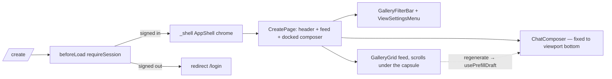

# _shell.create.tsx — AI component doc

> AI-facing sidecar for `_shell.create.tsx` (formerly `create.tsx`). Created 2026-07-06. Keep this in sync with the code on every change.

## Purpose

The `/create` route: auth-guarded generation screen in the Higgsfield
arrangement — the media feed IS the page, and the `ChatComposer` capsule is
docked over its bottom edge. Lives under the pathless `_shell` layout, so it
renders inside the AppShell chrome (URL unchanged).

## What it does (for an AI reader)

- Responsibilities: route registration (`/_shell/create` → URL `/create`),
  `beforeLoad` auth guard, page layout (filter header → scrolling feed →
  docked composer). Composition only — no business logic (modular-architecture
  rule for routes/).
- Public API / exports: `Route` (TanStack file-route).
- Inputs → Outputs: navigation to `/create` → guard check → filter header
  (`GalleryFilterBar` + `ViewSettingsMenu`), scrolling `GalleryGrid` feed
  (`hasCreateCta=false`, regenerate prefills the composer via
  `usePrefillDraft`), `ChatComposer` docked over the feed with the entities the
  user may tag; signed-out → thrown redirect to `/login`.
- Side effects: `requireSession()` performs a session fetch in `beforeLoad`;
  `useCatalog` powers the filter model options.

## Dependencies

- Imports: `@tanstack/react-router`, `react-i18next`, `modules/Auth`
  (`requireSession`), `modules/Generator` (`ChatComposer`, `useCatalog`,
  `usePrefillDraft`), `modules/Gallery` (`GalleryGrid`, `GalleryFilterBar`,
  `ViewSettingsMenu`), `modules/Entities` (taggable entities query).
- Used by: `routeTree.gen.ts` (generated, as child of `_shell.tsx`), `main.tsx` router.

## Diagram

## Key decisions / gotchas

- Guard in `beforeLoad`, not in the component: no flash of the private screen,
  no wasted catalog fetch for signed-out visitors.
- COMPOSER WRAPPER IS `fixed`, NOT `absolute` (owner call, 2026-07-16): the old
  `absolute inset-x-0 bottom-0` inside `main` only pinned while main's
  `h-[calc(100dvh-4rem)]` exactly matched the viewport remainder — any drift
  (mobile dvh churn, shell header height changes) let the capsule scroll away
  with the page, a layout bug that kept coming back. `fixed` docks it to the
  viewport unconditionally. The shell has no sidebar, so viewport centering
  stays aligned with the feed column. The wrapper stays click-through
  (`pointer-events-none`; the capsule re-enables pointer events), and the feed
  keeps `pb-40` as the runway so the last row clears the capsule.
- The feed section owns the scroll (`min-h-0 flex-1 overflow-y-auto`) — `min-h-0`
  is load-bearing; without it the flex child refuses to shrink and the scroll
  never engages.
- Task 18 moved the file under the `_shell` pathless layout: the shell owns the
  page canvas, so no `min-h-screen bg-paper` wrapper here.
- v3 terminal restyle: heading law (`text-3xl font-normal text-white`), hairline
  borders; composition/behavior untouched; the composer itself lives in
  `modules/Generator`.

## Commits

- 2b7dd54 2026-07-06 feat(web): generator module — prompt, model/aspect/duration, i2v upload, cost
- 9ffc310 2026-07-06 feat(web): gallery with 4-state cards and 4s polling of processing items (adds the gallery column)
- 01c29ab 2026-07-06 feat(web): app shell with nav, balance, language switch (moved under `_shell` layout)
- cb228e3 2026-07-07 restyle(web): editorial app shell, auth, generator, gallery
- 252ab38 2026-07-07 restyle(web): terminal design system — cosmic void tokens, jetbrains mono, specimen pills + docs
