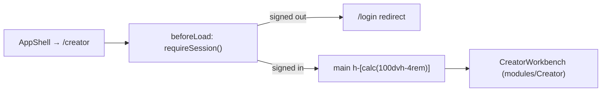

# _shell.creator.tsx — AI component doc

> AI-facing sidecar for `_shell.creator.tsx`. Created 2026-07-30. Keep this in sync with the code on every change.

## Purpose
The `/creator` screen's route: openCreator inside the AppShell chrome, auth-guarded, giving the workbench a fixed viewport-height canvas. Composition only.

## What it does (for an AI reader)
- Responsibilities: register the route under the `_shell` layout; bounce signed-out visitors in `beforeLoad`; provide the full-height page canvas the chat scroller needs.
- Public API / exports / props / endpoints: `Route` (the only allowed export). No endpoints.
- Inputs → Outputs: a `/creator` navigation → the guarded `CreatorWorkbench`.
- Side effects (I/O, network, state): `requireSession()` may redirect before any private UI mounts.

## Dependencies
- Imports / depends on: `@tanstack/react-router` (`createFileRoute`), `modules/Auth` (`requireSession`), `modules/Creator` (`CreatorWorkbench`).
- Used by: the generated `routeTree.gen.ts`; linked from `shared/ui/AppShell` (`nav.creator`).

## Diagram

## Key decisions / gotchas
- **`h-[calc(100dvh-4rem)]` with `overflow-hidden`, the `/create` precedent.** `dvh` not `vh`: mobile Safari's `vh` includes the retracted URL bar, which would push the composer below the fold. The 4rem is the AppShell header. The height is FIXED rather than grown by content because the transcript is its own scroller and the composer must stay pinned at the bottom while the conversation scrolls.
- **Only `Route` is exported.** The page component stays private or the router plugin cannot code-split the screen (`autoCodeSplitting`).
- **No business logic here.** Which conversation is open and where a message is posted live in `modules/Creator/CreatorWorkbench` — a route that made those decisions could not be tested without booting a router.
- **`routeTree.gen.ts` is generated**: the route entry appears there automatically on any vite/vitest run. It is a shared file — when committing alongside other in-flight route work, stage only the hunks for this route.

## Commits
- _no commit yet_
