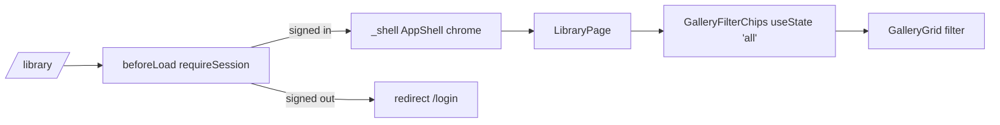

# _shell.library.tsx — AI component doc

> AI-facing sidecar for `_shell.library.tsx` (formerly `library.tsx`). Created 2026-07-06. Keep this in sync with the code on every change.

## Purpose

The `/library` route: auth-guarded personal gallery page — filter chips over
the full generations grid. Lives under the pathless `_shell` layout since
Task 18, so it renders inside the AppShell chrome (URL unchanged).

## What it does (for an AI reader)

- Responsibilities: route registration (`/_shell/library` → URL `/library`),
  `beforeLoad` auth guard, page layout, page-local filter state. Composition
  only — no business logic.
- Public API / exports: `Route` (TanStack file-route).
- Inputs → Outputs: navigation to `/library` → guard check → h1 + chips + grid;
  signed-out → thrown redirect to `/login`.
- Side effects: `requireSession()` session fetch in `beforeLoad`.

## Dependencies

- Imports: `react` (`useState`), `@tanstack/react-router`, `react-i18next`,
  `modules/Auth` (`requireSession`), `modules/Gallery` (`GalleryFilterChips`,
  `GalleryGrid`, `GalleryFilter`).
- Used by: `routeTree.gen.ts` (generated, as child of `_shell.tsx`), `main.tsx` router.

## Diagram

## Key decisions / gotchas

- The filter is plain `useState` in the route (page-local UI state), reset to
  "All" on every visit by design — not URL state, not a store.
- Task 18 moved the file under the `_shell` pathless layout: the shell now owns
  the page canvas (`bg-paper` + min-height + header), so the old
  `min-h-screen bg-paper` wrapper was removed from this screen.

- v3 terminal restyle: h1 = `text-3xl font-normal text-white` over the standard
  `border-white/10` hairline — the same terminal opener as /create and /pricing
  (brief QA #6). Filter chips and grid behavior untouched.

## Commits

- 9ffc310 2026-07-06 feat(web): gallery with 4-state cards and 4s polling of processing items
- 01c29ab 2026-07-06 feat(web): app shell with nav, balance, language switch (moved under `_shell` layout)
- cb228e3 2026-07-07 restyle(web): editorial app shell, auth, generator, gallery
- 252ab38 2026-07-07 restyle(web): terminal design system — cosmic void tokens, jetbrains mono, specimen pills + docs
