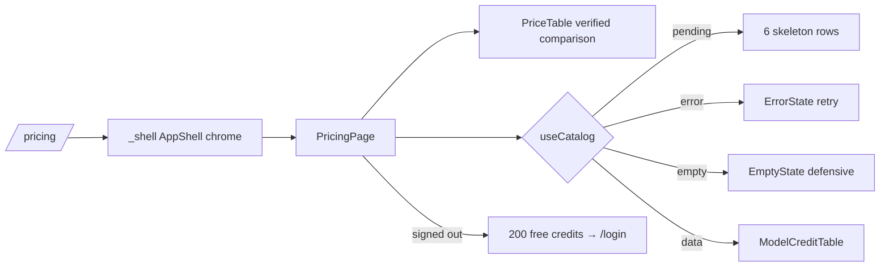

# _shell.pricing.tsx — AI component doc

> AI-facing sidecar for `_shell.pricing.tsx`. Created 2026-07-06. Keep this in sync with the code on every change.

## Purpose
The `/pricing` route (inside the AppShell layout, public — no auth guard):
the editorial "index" page — kicker + display serif title with the
"200 free credits" accent stamp, verified price comparison, live per-model
credit table, and the signup CTA for visitors as a tinted sand block.

## What it does (for an AI reader)
- Responsibilities: editorial header (uppercase `pricing.kicker`, serif h1,
  `Badge variant="accent"` stamp `pricing.stamp`), compose `PriceTable`
  (modules/Landing, opening 01 section), the catalog query (`useCatalog` from
  modules/Generator) with all 4 UI states around `ModelCreditTable` under a
  `SectionHeading ordinal="02"`, and a session-aware signup CTA (sand block,
  ink-pill link). Composition only.
- Public API / exports: `Route` only (`PricingPage` stays private — the router
  plugin cannot code-split route files with extra exports).
- Inputs → Outputs: catalog query → skeleton rows / `ErrorState` retry /
  defensive `EmptyState` / `ModelCreditTable models=…`; session → CTA card
  rendered only when signed out.
- Side effects: `useCatalog` fires `GET /api/catalog` (shared `['catalog']`
  cache — no extra request if the user visited /create first);
  `useAuthSession` reads the session store.

## Dependencies
- Imports / depends on: `@tanstack/react-router` (`Link`, `createFileRoute`),
  `react-i18next`, `modules/Auth` (`useAuthSession`), `modules/Generator`
  (`useCatalog`), `modules/Landing` (`ModelCreditTable`, `PriceTable`,
  `SectionHeading`), `shared/ui` (`Badge`, `EmptyState`, `ErrorState`,
  `Skeleton`).
- Used by: `routeTree.gen.ts` (child of `_shell.tsx`), AppShell nav.

## Diagram

## Key decisions / gotchas
- Public on purpose: signed-out visitors comparing prices is the page's whole
  job; the shell shows "Sign in" for them, the balance chip when signed in.
- Plan said `routes/pricing.tsx`; it lives at `_shell.pricing.tsx` so the nav
  (Create/Library/Pricing) stays visible — URL is `/pricing` either way.
- The signup CTA quotes exact honest math: 200 credits = up to 200 images or
  five 5s videos (35×5=175) — no inflated claims.
- The "200 free credits" stamp shows for everyone (a fact about signup); only
  the CTA block itself is visitor-only. Stamp = `Badge accent` — the
  brief-sanctioned small vermillion use (design.md §2).
- Stage 2 dropped the white cards: skeletons sit in a hairline frame, the CTA
  is a sand tinted block — no `bg-white`/`shadow` remains on this page.

## Commits
- a04eac7 2026-07-06 feat(web): pricing page with per-model credit table
- 2f56573 2026-07-07 restyle(web): editorial landing + pricing
