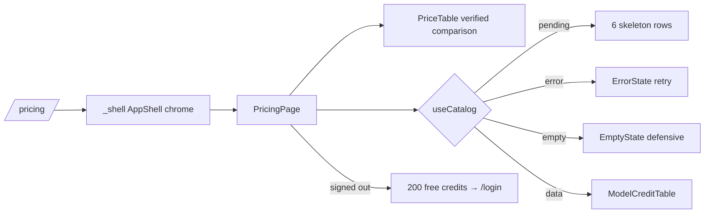

# _shell.pricing.tsx — AI component doc

> AI-facing sidecar for `_shell.pricing.tsx`. Created 2026-07-06. Keep this in sync with the code on every change.

## Purpose
The `/pricing` route (inside the AppShell layout, public — no auth guard):
the v3 terminal "index" page — quiet mono kicker + mono weight-400 30px title
with the "200 free credits" accent chip, verified price comparison, live
per-model credit table, and the signup CTA for visitors as a steel surface card.

## What it does (for an AI reader)
- Responsibilities: terminal header (lowercase `pricing.kicker`, mono h1,
  `Badge variant="accent"` chip `pricing.stamp`), compose `PriceTable`
  (modules/Landing, opening section), the catalog query (`useCatalog` from
  modules/Generator) with all 4 UI states around `ModelCreditTable` under a
  `SectionHeading` (Stage 2: amber spark icon, no ordinals), and a
  session-aware signup CTA (steel card, green specimen-pill link).
  Composition only. Stage 2 narrowed the main column to `max-w-[50rem]` —
  /pricing reads as the same ~800px research document as the landing.
- Public API / exports: `Route` only (`PricingPage` stays private — the router
  plugin cannot code-split route files with extra exports).
- Inputs → Outputs: catalog query → skeleton rows / `ErrorState` retry /
  defensive `EmptyState` / `ModelCreditTable models=…`; session → CTA card
  rendered only when signed out.
- Side effects: `useCatalog` fires `GET /api/catalog` (shared `['catalog']`
  cache — no extra request if the user visited /create first);
  `useAuthSession` reads the session store.

## Dependencies
- Imports / depends on: `@tanstack/react-router` (`Link`, `createFileRoute`),
  `react-i18next`, `modules/Auth` (`useAuthSession`), `modules/Generator`
  (`useCatalog`), `modules/Landing` (`ModelCreditTable`, `PriceTable`,
  `SectionHeading`), `shared/ui` (`Badge`, `EmptyState`, `ErrorState`,
  `Skeleton`).
- Used by: `routeTree.gen.ts` (child of `_shell.tsx`), AppShell nav.

## Diagram

## Key decisions / gotchas
- Public on purpose: signed-out visitors comparing prices is the page's whole
  job; the shell shows "Sign in" for them, the balance chip when signed in.
- Plan said `routes/pricing.tsx`; it lives at `_shell.pricing.tsx` so the nav
  (Create/Library/Pricing) stays visible — URL is `/pricing` either way.
- The signup CTA quotes exact honest math: 200 credits = up to 200 images or
  five 5s videos (35×5=175) — no inflated claims.
- The "200 free credits" chip shows for everyone (a fact about signup); only
  the CTA block itself is visitor-only. Chip = `Badge accent` → glow-amber
  (amber = the triad's pricing/explore family, design.md v3 §2).
- v3 restyle intent: the CTA card is `bg-steel rounded-lg` (app-screen cards
  live on #1d293d per the adaptation table), its link is the GREEN specimen
  pill (sign-up = create action); the h1 obeys the 30px/400 heading law — no
  more `md:text-6xl` escalation, hierarchy comes from white-vs-mist color.

- Stage 2 restyle: `ModelCreditTable` credit numerals glow specimen-green
  (the "go/us" numbers), the comparison footnote is portal-blue — the same
  terminal treatment as the landing's index section.

## Commits
- a04eac7 2026-07-06 feat(web): pricing page with per-model credit table
- 2f56573 2026-07-07 restyle(web): editorial landing + pricing
- 252ab38 2026-07-07 restyle(web): terminal design system — cosmic void tokens, jetbrains mono, specimen pills + docs
- (pending) restyle(web): terminal landing with ascii-sphere hero + pricing (research column, no ordinals)
