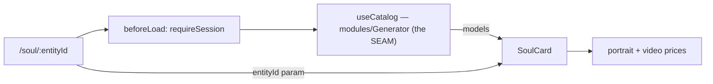

# _shell.soul.$entityId.tsx — AI component doc

> AI-facing sidecar for `_shell.soul.$entityId.tsx`. Created 2026-07-12. Keep this in sync with the code on every change.

## Purpose

The `/soul/:entityId` screen — the soul card. Auth-guarded route, composition plus
the cross-module seam that feeds the catalog (and therefore the prices) into the
Soul module.

## What it does (for an AI reader)

- Responsibilities: guard the session; read the shared `['catalog']` query via the
  Generator's public `useCatalog`; hand the models to `SoulCard` with the route param.
- Public API / exports: `Route` (TanStack file route `/_shell/soul/$entityId`).
- Side effects: `beforeLoad` redirect; `GET /api/catalog` (cached, one per session).

## Dependencies

- Imports: `@tanstack/react-router`, `modules/Auth`, `modules/Generator`
  (`useCatalog`), `modules/Soul` (`SoulCard`).
- Used by: the generated route tree.

## Diagram

## Key decisions / gotchas

- Soul must not import Generator (cross-module law), so the ROUTE reads the catalog
  and passes it down — exactly what `/cinema/$filmId` does for `FilmEditor`.
- An empty catalog means "price unknown": the mint buttons stay DISABLED rather than
  quote a number they cannot back up.

## Commits

- _no commit yet_
