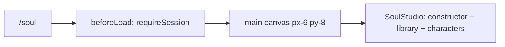

# _shell.soul.index.tsx — AI component doc

> AI-facing sidecar for `_shell.soul.index.tsx`. Created 2026-07-12. Keep this in sync with the code on every change.

## Purpose

The `/soul` screen — AI Soul Studio. Auth-guarded route, composition only: the Soul
module owns the draft, the pickers and the mutations; the route owns the canvas.

## What it does (for an AI reader)

- Responsibilities: guard the session (`requireSession`), lay out the full-bleed
  page canvas (matching `/create`, `/library`, `/entities`), render `SoulStudio`.
- Public API / exports: `Route` (TanStack file route `/_shell/soul/`).
- Side effects: `beforeLoad` redirect for signed-out visitors.

## Dependencies

- Imports: `@tanstack/react-router`, `modules/Auth` (`requireSession`),
  `modules/Soul` (`SoulStudio`).
- Used by: the generated route tree (`src/routeTree.gen.ts`).

## Diagram

## Key decisions / gotchas

- NO catalog is read here: nothing on this screen costs credits. The prices — and
  therefore the catalog — live on the soul card, where the paid actions are.

## Commits

- _no commit yet_
