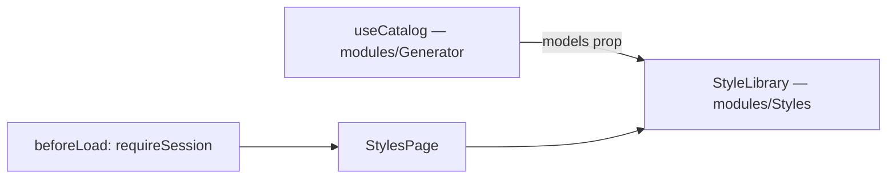

# _shell.styles.tsx — AI component doc

> AI-facing sidecar for `_shell.styles.tsx`. Created 2026-07-31. Keep this in sync with the code on every change.

## Purpose
The `/styles` screen — the style constructor and library. Auth-guarded,
composition only: the Styles module owns the list, the editor and every mutation;
this lays out the full-bleed canvas and supplies the one cross-module dependency.

## What it does (for an AI reader)
- Responsibilities: bounce signed-out visitors (`requireSession`); read the model
  catalog and hand it to `StyleLibrary`; render the page canvas.
- Public API / exports / endpoints: `Route` (`/_shell/styles`). No endpoints of
  its own; `useCatalog` reads `GET /api/catalog`.
- Inputs → Outputs: a session → the styles page; the catalog → `models` on
  `StyleLibrary`.
- Side effects: the `['catalog']` query (shared, one fetch per session).

## Dependencies
- Imports / depends on: `@tanstack/react-router`, `modules/Auth`
  (`requireSession`), `modules/Generator` (`useCatalog`), `modules/Styles`
  (`StyleLibrary`).
- Used by: the generated route tree; reachable from the AppShell nav («Стили»).

## Diagram

## Key decisions / gotchas
- **The catalog is read HERE, not inside the module.** `modules/Styles` must not
  import `modules/Generator` (modules never import each other), and the style
  editor needs the catalog twice: to offer a recommended model, and to price the
  preview button from the model that will actually run it. This is the same
  cross-module seam `routes/cinema.$filmId.tsx` uses for catalog/templates/
  entities.
- **Same `['catalog']` cache entry the composer uses**, so landing here after
  `/create` costs no request.
- **Layout matches `/entities` and `/library`** (`px-6 py-8 xl:px-10`, full-bleed):
  the three library screens are the same kind of surface and should not drift.

## Commits
- _no commit yet_
