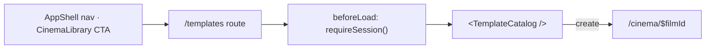

# _shell.templates.index.tsx — AI component doc

> AI-facing sidecar for `_shell.templates.index.tsx`. Created 2026-07-11. Keep this in sync with the code on every change.

## Purpose

The template catalog screen (`/templates`) — the gallery of ready-made viral formats.
Composition only: the route lays out the full-bleed canvas and guards the session; the
Templates module owns everything inside it.

## What it does (for an AI reader)

- Responsibilities: register the file route, bounce signed-out visitors, render
  `<TemplateCatalog />` inside the standard page `<main>`.
- Public API / exports / endpoints: `Route` (`createFileRoute('/_shell/templates/')`),
  route path `/templates`, under the `_shell` layout (nav + balance chip).
- Inputs → Outputs: none → the page.
- Side effects (I/O, network, state): `beforeLoad: () => requireSession()` — a redirect
  for a signed-out visitor. All data fetching happens inside `TemplateCatalog`.

## Dependencies

- Imports / depends on: `@tanstack/react-router` (`createFileRoute`), `modules/Auth`
  (`requireSession`), `modules/Templates` (`TemplateCatalog`).
- Used by: the generated route tree; linked from `AppShell` nav (`/templates`, sitting
  next to Cinema) and from `CinemaLibrary` (the primary "Из шаблона" CTA and the empty
  state).

## Diagram

## Key decisions / gotchas

- **Auth-guarded like `/cinema` and `/entities`.** There is nothing a signed-out visitor
  can do with the gallery, and the landing page is where we sell the product. (The API's
  `GET /api/templates` is session-gated to match.)
- **Composition only — zero logic.** The route does not read the templates query itself;
  `TemplateCatalog` does. Contrast `_shell.cinema.$filmId.tsx`, which DOES call
  `useTemplates()` — it has to, because that is the cross-module seam that keeps Cinema
  from importing Templates.
- The `px-6 py-8 xl:px-10` canvas matches the app-chrome gutter used by every other
  full-bleed screen.

## Commits

- _no commit yet_
