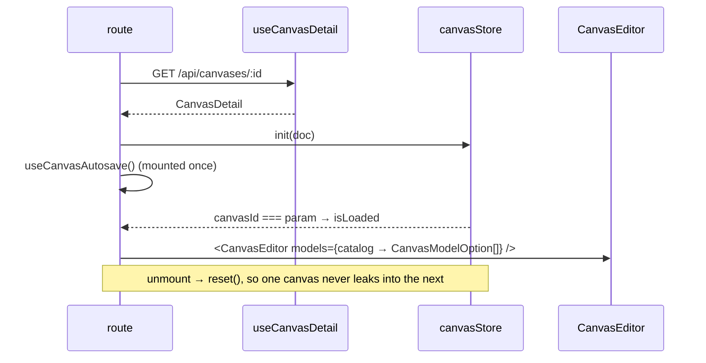

# canvas.$canvasId.tsx — AI component doc

> AI-facing sidecar for `canvas.$canvasId.tsx`. Created 2026-07-30. Keep this in sync with the code on every change.

## Purpose
The `/canvas/:canvasId` route: the full-viewport board editor. A FLAT filename puts it outside `_shell`, so it owns the whole viewport and assembles its own header — the `cinema.$filmId` pattern. It also owns the two things a route is allowed to own: the cross-module seams and the per-document lifecycle.

## What it does (for an AI reader)
- Responsibilities: guard the route; load the document and init/reset the store; mount the autosave loop; map the catalog AND the character library into node data; render the header (back link, title input, save status, balance) and the board with its own loading/error states.
- Public API / exports / props / endpoints: `Route` (`/canvas/$canvasId`), guarded by `beforeLoad: requireSession`. Reads `GET /api/canvases/:id`, `GET /api/catalog` and `GET /api/entities`.
- Inputs → Outputs: the `canvasId` param → a loaded document in the store → `<CanvasEditor models={…} entities={…} />`.
- Side effects (I/O, network, state): session check, three queries, store `init`/`reset`, autosave subscription, title edits.

## Dependencies
- Imports / depends on: `react`, `@tanstack/react-router`, `react-i18next`, `requireSession` (modules/Auth), `BalanceChip` (modules/Credits), `useEntities` (modules/Entities), `useCatalog` (modules/Generator), the `modules/Canvas` barrel, `ErrorState`/`Skeleton` from `shared/ui`.
- Used by: `routeTree.gen.ts`; entered from `CanvasLibrary` cards and after creating a canvas.

## Diagram

## Key decisions / gotchas
- THE catalog seam: `modules/Canvas` may not import `modules/Generator`, so `useCatalog()` is read HERE and mapped to `CanvasModelOption[]`. Video models carry their whole `creditsByDuration` table so a node can price the run at the duration the user picked, not at the cheapest one.
- THE chrome seam: with no AppShell, `BalanceChip` is composed here (routes may import `modules/Credits`; the module may not).
- The board waits for `isLoaded` (`store.canvasId === param`), not just for the query: React Flow reads `defaultViewport` once at mount, so rendering before `init()` would drop the saved camera and flash the previous canvas's nodes for a frame.
- `reset()` in the effect cleanup is what makes a singleton store safe across route params.
- The page is `h-svh` (not `min-h-svh`): a board pans, it does not scroll, and the flex children need a definite height for React Flow to size itself.
- The autosave status is quiet by design — a `saved`/`saving…` caption, and an amber "not saved · retry" button on failure. No toasts: an autosave that shouts on every network blip trains people to ignore it.

## Commits
- bcb3148 2026-07-30 feat(canvas-web): editor shell, palette, library, routes
- 87c6d3c 2026-07-30 feat(canvas-web): character node — a Soul character as a wired reference

## Update 2026-07-30 — memoized model options (focus-loss fix, route side)

- `models` is now built by module-scope `buildModelOptions(catalog.data?.models)`
  inside `useMemo([catalog.data])`. Its IDENTITY is load-bearing: it feeds the
  editor's per-node RF cache (see CanvasEditor.tsx.md, same-day update) — a fresh
  array per render voided that cache and resurrected the React Flow v12
  visibility-flicker focus loss (one typed char per click).

## Update 2026-07-30 — character library seam (ADR phase 3a)

- SECOND cross-module seam, same law as the catalog: `modules/Canvas` may not
  import `modules/Entities`, so `useEntities()` is read HERE and narrowed to
  `CanvasEntityOption[]` (id · name · primary photo url) — the identical
  derivation `routes/cinema.$filmId.tsx` uses for a shot's cast, including the
  `primaryImageId → first image → null` fallback.
- MEMOIZED on `entities.data` for exactly the reason `models` is: the array
  identity is part of the editor's per-node RF cache key.
- `buildModelOptions` now also carries `referenceMode` (nullable). It is the one
  catalog capability a node needs locally: with a character wired, the model
  picker must hide models the API would refuse.
- `useEntities` shares the `['entities']` cache with `/create` and the Cinema
  editor, so opening a board costs no extra request in a warm session.
