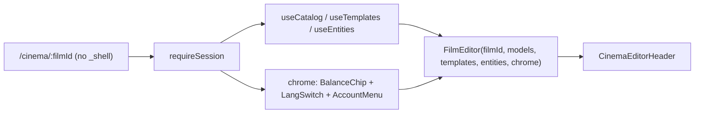

# cinema.$filmId.tsx — AI component doc

> AI-facing sidecar for `cinema.$filmId.tsx`. Created 2026-07-09. Keep this in sync with the code on every change.

## Purpose

The `/cinema/:filmId` editor route — auth-guarded. Since 2026-07-23 it lives OUTSIDE the
global `_shell` AppShell (owner: "раздел кино совершенно другой должен быть, свой хедер"):
the editor renders its OWN full-bleed top bar (`CinemaEditorHeader`, via `FilmEditor`)
instead of the app-wide nav. The route does two composition jobs: (1) THREE cross-module
SEAMS — `useCatalog`, `useTemplates`, `useEntities` read here and handed to `FilmEditor`;
(2) the GLOBAL CHROME (balance · lang · account) the editor bar needs, composed here and
passed as the `chrome` slot (this screen has no AppShell to supply it).

## What it does (for an AI reader)

- Responsibilities: route wiring, read the `filmId` param, feed catalog/templates/entities,
  and compose the balance·lang·account chrome node.
- Public API / exports: `Route` (TanStack file route `/cinema/$filmId` — a TOP-LEVEL route,
  no longer nested under `_shell`).
- Inputs → Outputs: `filmId` param + catalog + templates + entities + session → the editor
  page with its own chrome.
- Side effects: `beforeLoad: requireSession()`; `useCatalog`/`useTemplates`/`useEntities`
  queries (shared cache entries); on sign-out `queryClient.clear()` + navigate `/`.

## Dependencies

- Imports: `@tanstack/react-router` (`createFileRoute`, `useNavigate`),
  `@tanstack/react-query` (`useQueryClient`), `modules/Auth` (`requireSession`, `signOut`,
  `useAuthSession`), `modules/Cinema` (`FilmEditor`), `modules/Credits` (`BalanceChip`),
  `modules/Entities` (`useEntities`), `modules/Generator` (`useCatalog`),
  `modules/Templates` (`useTemplates`), `shared/ui` (`AccountMenu`, `LangSwitch`).
- Used by: the generated route tree (FilmCard `Link`, create-film navigate, template
  instantiation navigate).

## Diagram

## Key decisions / gotchas

- Cinema/shared-ui must NOT import Generator/Templates/Entities/Auth/Credits; the ROUTE is
  the seam that reads them and passes `models`/`templates`/`entities`/`chrome` down.
- Breaking out of `_shell` is what lets the editor own the whole top bar. `/cinema` (the
  library index) STAYS under `_shell` — only the editor screen is standalone.
- The chrome composition mirrors `routes/_shell.tsx` exactly (normalize name, clear cache +
  navigate home on sign-out), so the account affordance behaves identically to every other
  screen.

## Update 2026-07-15 — v5 compact canvas
- Route canvas gap-8 px-6 py-8 → gap-4 px-4 py-4 xl:px-6: the editor is a workbench. Since
  2026-07-23 that padding lives INSIDE `FilmEditor`'s `<main>` (the route hands it the full
  width so the top bar can be full-bleed).

## Commits

- _no commit yet_

## Update 2026-07-31 — reads the style registry for the editor's pickers
- Adds `useStyles()` (from `modules/Styles`) as a FOURTH cross-module seam beside
  `useCatalog`, `useTemplates` and `useEntities`, passing `styles.data?.items ?? []`
  to `FilmEditor`, which fans it out to the shot inspector, the storyboard and the
  film-settings modal (ADR style-studio D5).
- Routes MAY import modules; `modules/Cinema` may not import `modules/Styles`, which
  is exactly why the read happens here.
- Same `['styles']` cache entry the `/styles` page fills, so arriving from the Style
  Studio into a film costs no extra request.
