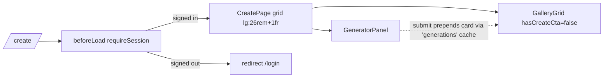

# create.tsx — AI component doc

> AI-facing sidecar for `create.tsx`. Created 2026-07-06. Keep this in sync with the code on every change.

## Purpose

The `/create` route: auth-guarded generation screen composing the Generator
panel (and, from Task 17, the live Gallery column).

## What it does (for an AI reader)

- Responsibilities: route registration, `beforeLoad` auth guard, page layout.
  Composition only — no business logic (modular-architecture rule for routes/).
- Public API / exports: `Route` (TanStack file-route).
- Inputs → Outputs: navigation to `/create` → guard check → two-column render
  (GeneratorPanel left, live `GalleryGrid hasCreateCta=false` right; mobile stacks);
  signed-out → thrown redirect to `/login`.
- Side effects: `requireSession()` performs a session fetch in `beforeLoad`.

## Dependencies

- Imports: `@tanstack/react-router`, `react-i18next`, `modules/Auth` (`requireSession`),
  `modules/Generator` (`GeneratorPanel`), `modules/Gallery` (`GalleryGrid`).
- Used by: `routeTree.gen.ts` (generated), `main.tsx` router.

## Diagram

## Key decisions / gotchas

- Guard in `beforeLoad`, not in the component: no flash of the private screen,
  no wasted catalog fetch for signed-out visitors.
- Screen runs on paper (`bg-paper`) and will move inside the AppShell in Task 18
  (design.md §9 screen rules).

## Commits

- 2b7dd54 2026-07-06 feat(web): generator module — prompt, model/aspect/duration, i2v upload, cost
- 9ffc310 2026-07-06 feat(web): gallery with 4-state cards and 4s polling of processing items (adds the gallery column)
