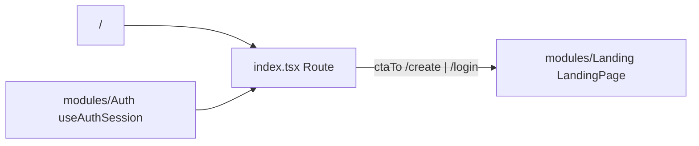

# index.tsx — AI component doc

> AI-facing sidecar for `index.tsx`. Created 2026-07-06. Keep this in sync with the code on every change.

## Purpose
Landing route (`/`) — thin composition wrapper: reads the session and renders
`modules/Landing`'s `LandingPage` with the CTA destination.

## What it does (for an AI reader)
- Responsibilities: `createFileRoute('/')`; decide `ctaTo` from the session
  (`/create` signed in, `/login` otherwise). No layout/business logic here.
- Public API / exports: `Route`.
- Inputs → Outputs: better-auth session snapshot → `<LandingPage ctaTo=…/>`.
- Side effects: `useAuthSession` triggers better-auth's session fetch on mount.

## Dependencies
- Imports / depends on: `@tanstack/react-router`, `modules/Auth`
  (`useAuthSession`), `modules/Landing` (`LandingPage`).
- Used by: `routeTree.gen.ts`; smoke-tested by `src/routes/__root.test.tsx`
  (mocks `modules/Auth`, asserts the EN hero headline via memory-history router).

## Diagram

## Key decisions / gotchas
- The session read lives HERE because `modules/Landing` must not import
  `modules/Auth` (cross-module imports are banned) — routes are the
  composition layer.
- While the session is still resolving the visitor CTA (`/login`) shows; a
  signed-in user who clicks it is bounced `/login → /create` by the login
  route, so no wrong destination is reachable.
- Landing stays OUTSIDE the `_shell` AppShell layout — standalone marketing
  screen with its own top bar (design.md §9).

## Commits
- c987d5f 2026-07-06 feat(web): vite scaffold, tanstack router, i18n, providers (placeholder)
- _pending: feat(web): landing with honest price comparison (EN/RU)_
