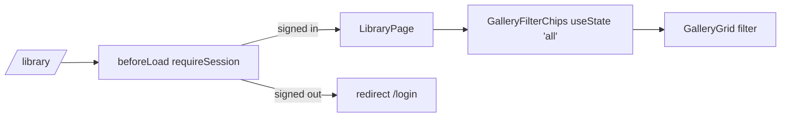

# library.tsx — AI component doc

> AI-facing sidecar for `library.tsx`. Created 2026-07-06. Keep this in sync with the code on every change.

## Purpose

The `/library` route: auth-guarded personal gallery page — filter chips over
the full generations grid.

## What it does (for an AI reader)

- Responsibilities: route registration, `beforeLoad` auth guard, page layout,
  page-local filter state. Composition only — no business logic.
- Public API / exports: `Route` (TanStack file-route).
- Inputs → Outputs: navigation to `/library` → guard check → h1 + chips + grid;
  signed-out → thrown redirect to `/login`.
- Side effects: `requireSession()` session fetch in `beforeLoad`.

## Dependencies

- Imports: `react` (`useState`), `@tanstack/react-router`, `react-i18next`,
  `modules/Auth` (`requireSession`), `modules/Gallery` (`GalleryFilterChips`,
  `GalleryGrid`, `GalleryFilter`).
- Used by: `routeTree.gen.ts` (generated), `main.tsx` router.

## Diagram

## Key decisions / gotchas

- The filter is plain `useState` in the route (page-local UI state), reset to
  "All" on every visit by design — not URL state, not a store.
- Screen runs on paper and moves inside the AppShell in Task 18 (design.md §9).

## Commits

- (pending) feat(web): gallery with 4-state cards and 4s polling of processing items
