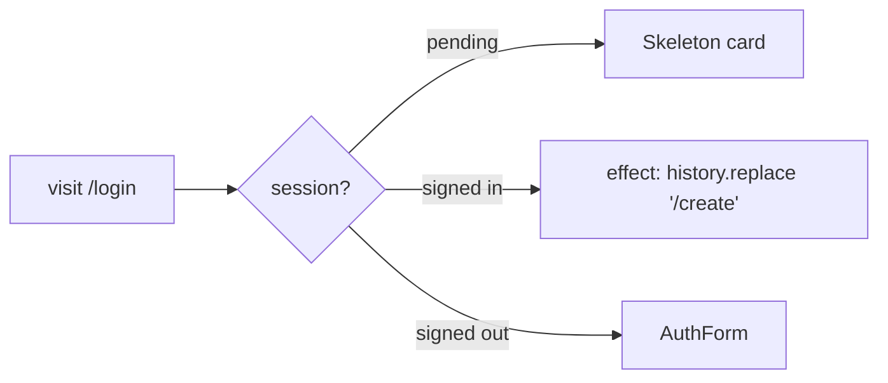

# login.tsx — AI component doc

> AI-facing sidecar for `login.tsx`. Created 2026-07-06. Keep this in sync with the code on every change.

## Purpose

The `/login` file-based route: renders the Auth module's form centered on paper and
redirects already-signed-in visitors to `/create`.

## What it does (for an AI reader)

- Responsibilities: composition only (modular rule: no business logic in `routes/`) —
  session gate + layout.
- Public API / exports / props / endpoints: `Route` (TanStack `createFileRoute('/login')`).
- Inputs → Outputs: session state → pending/redirecting → card-shaped `Skeleton`;
  signed in → effect runs `router.history.replace('/create')`; signed out → `<AuthForm />`.
- Side effects (I/O, network, state): `useAuthSession` triggers better-auth's
  get-session fetch; history replace on redirect.

## Dependencies

- Imports / depends on: `react` (useEffect), `@tanstack/react-router`
  (createFileRoute, useRouter), `modules/Auth` (AuthForm, useAuthSession),
  `shared/ui` (Skeleton).
- Used by: route tree (`routeTree.gen.ts`, auto-generated).

## Diagram

## Key decisions / gotchas

- Redirect uses `router.history.replace('/create')` in an effect instead of the typed
  `<Navigate to>`: `/create` ships in plan Task 16, so the typed route union does not
  include it yet (Navigate's `RequiredToOptions` rejects `href`-only props too). Switch
  to `navigate({ to: '/create' })` once Task 16 lands.
- Post-login redirect also flows through here: AuthForm succeeds → session store
  updates → this component re-renders and the redirect effect fires.
- Skeleton during `isPending` prevents a form flash for already-authenticated users.

## Commits

- _no commit yet_
