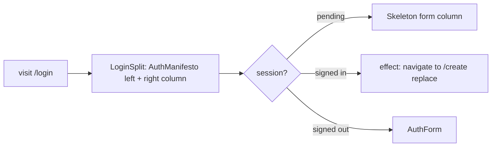

# login.tsx — AI component doc

> AI-facing sidecar for `login.tsx`. Created 2026-07-06. Keep this in sync with the code on every change.

## Purpose

The `/login` file-based route: the v3 terminal split — `AuthManifesto` on the abyss
step left, `AuthForm` on the void right — and the redirect of already-signed-in visitors to
`/create`.

## What it does (for an AI reader)

- Responsibilities: composition only (modular rule: no business logic in `routes/`) —
  session gate + layout.
- Public API / exports / props / endpoints: `Route` (TanStack `createFileRoute('/login')`).
- Inputs → Outputs: session state → pending/redirecting → form-column `Skeleton`
  inside the same `LoginSplit` frame (one silhouette across states); signed in →
  effect runs `navigate({ to: '/create', replace: true })`; signed out → `<AuthForm />`.
- Side effects (I/O, network, state): `useAuthSession` triggers better-auth's
  get-session fetch; replace-navigation on redirect.

## Dependencies

- Imports / depends on: `react` (useEffect, ReactNode), `@tanstack/react-router`
  (createFileRoute, useNavigate), `modules/Auth` (AuthForm, AuthManifesto,
  useAuthSession), `shared/ui` (Skeleton).
- Used by: route tree (`routeTree.gen.ts`, auto-generated).

## Diagram

## Key decisions / gotchas

- Redirect now uses TYPED `useNavigate()({ to: '/create', replace: true })` — the
  `/create` route exists since Task 16, so the temporary `router.history.replace`
  escape hatch (documented while the typed union lacked the route) was removed as promised.
- Post-login redirect also flows through here: AuthForm succeeds → session store
  updates → this component re-renders and the redirect effect fires.
- Skeleton during `isPending` prevents a form flash for already-authenticated users.
- Split layout (`grid lg:grid-cols-[5fr_7fr]`); `LoginSplit` keeps pending/form
  states on ONE silhouette so the manifesto never flashes in/out while the session
  resolves. The route stays composition-only — both columns' content lives in
  `modules/Auth`. v3: the frame is `bg-void` (flat cosmic void, no gradient).

## Commits

- 1ecb2f7 2026-07-06 feat(web): api client + auth module (email/password, optional google)
- 2b7dd54 2026-07-06 feat(web): generator module — prompt, model/aspect/duration, i2v upload, cost (typed /create redirect)
- cb228e3 2026-07-07 restyle(web): editorial app shell, auth, generator, gallery
- (pending) restyle(web): terminal design system — cosmic void tokens, jetbrains mono, specimen pills + docs
