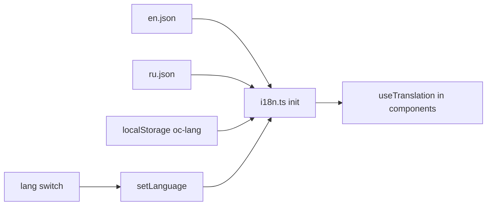

# i18n.ts — AI component doc

> AI-facing sidecar for `i18n.ts`. Created 2026-07-06. Keep this in sync with the code on every change.

## Purpose
i18next bootstrap for the SPA (EN + RU). Every user-facing string goes through translation keys that must exist in BOTH `locales/en.json` and `locales/ru.json` — hardcoded UI strings are banned.

## What it does (for an AI reader)
- Responsibilities: initialize i18next with `initReactI18next`, load both locale JSONs as `translation` namespaces, restore persisted language from `localStorage['oc-lang']` (fallback `en`), disable interpolation escaping (React escapes already).
- Public API / exports: default `i18n` instance; `setLanguage(lang: 'en' | 'ru')` — persists the choice and switches at runtime.
- Inputs → Outputs: `localStorage['oc-lang']` → initialized global i18n instance used by `useTranslation()` everywhere.
- Side effects: import-time `i18n.init(...)`; `setLanguage` writes `localStorage`.

## Dependencies
- Imports / depends on: `i18next`, `react-i18next`, `./locales/en.json`, `./locales/ru.json` (needs tsconfig `resolveJsonModule`).
- Used by: `routes/__root.tsx` (side-effect import), all components via `useTranslation`, app-shell language switch (Task 18) via `setLanguage`.

## Diagram

## Key decisions / gotchas
- `escapeValue: false` — React already escapes interpolated values; double-escaping mangles text.
- `localStorage` access is guarded (`typeof localStorage !== 'undefined'`) so the module also loads in non-browser contexts.
- Locale JSONs must stay key-for-key mirrored; adding a key to only one language is a bug.

## Commits
- _no commit yet_
