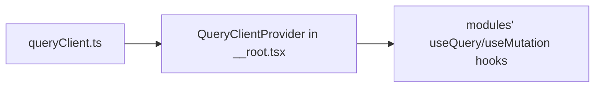

# queryClient.ts — AI component doc

> AI-facing sidecar for `queryClient.ts`. Created 2026-07-06. Keep this in sync with the code on every change.

## Purpose
The one TanStack Query client instance for the SPA — a single cache shared by all modules, provided at the root route.

## What it does (for an AI reader)
- Responsibilities: construct `QueryClient` with project defaults — `retry: 1`, `staleTime: 30_000`, `refetchOnWindowFocus: false`.
- Public API / exports: `queryClient` (singleton).
- Inputs → Outputs: none → configured `QueryClient` consumed by `QueryClientProvider` in `src/routes/__root.tsx`.
- Side effects: none at import time (cache mutates only at runtime via queries/mutations).

## Dependencies
- Imports / depends on: `@tanstack/react-query`.
- Used by: `routes/__root.tsx` (provider); later tasks' module hooks (`modules/*/model/*Api.ts`) read/write this cache.

## Diagram

## Key decisions / gotchas
- `refetchOnWindowFocus: false` on purpose: generation status uses explicit 4s `refetchInterval` polling (Task 17); focus refetches would add noise and duplicate requests.
- `staleTime` default 30s matches `/api/me` freshness needs; per-query overrides (e.g. catalog `staleTime: Infinity`) are expected.

## Commits
- _no commit yet_
