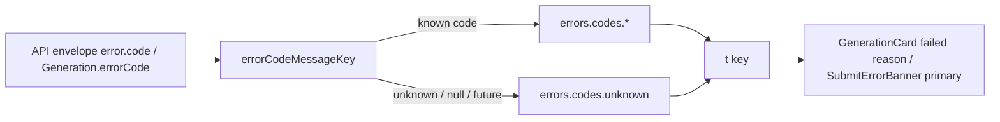

# errorCopy.ts — AI component doc

> AI-facing sidecar for `errorCopy.ts`. Created 2026-07-07. Keep this in sync with the code on every change.

## Purpose

The single code→copy bridge for API failures (QA finding 3): maps every
machine-readable error code from `@opencreate/contracts` `apiErrorCodeSchema`
(the envelope's `error.code`, also the `Generation.errorCode` field) to an
i18n key under `errors.codes.*`, with a generic fallback for unknown/missing
codes. Exists so BOTH the Gallery failed cards and the Generator submit banner
localize failures identically without importing each other (modules never
cross-import — shared/libs is their meeting point, same as `apiClient`).

## What it does (for an AI reader)

- Responsibilities: pure lookup, no I/O, no React, no business logic.
- Public API / exports:
  - `errorCodeMessageKey(code: string | null | undefined): string` — returns
    `errors.codes.<camelCode>` for the nine known codes, else
    `errors.codes.unknown`.
- Inputs → Outputs: `'provider_error'` → `'errors.codes.providerError'`;
  `'totally_new_code' | null | undefined | ''` → `'errors.codes.unknown'`.
- Side effects: none. Callers pass the result through `t()`.

## Dependencies

- Imports: `@opencreate/contracts` (type `ApiErrorCode` only — type-level, no runtime dep).
- Used by: `modules/Gallery/components/GenerationCard.tsx` (failed-state primary
  reason), `modules/Generator/components/SubmitErrorBanner.tsx` (banner primary
  copy). Copy lives in `shared/config/locales/{en,ru}.json` under `errors.codes`.

## Diagram

## Key decisions / gotchas

- Accepts `string`, not `ApiErrorCode`: GET bodies are cast (not zod-parsed) at
  the apiClient trust boundary, so a code added to the API before the SPA
  redeploys arrives as a plain string — it must degrade to the generic message,
  never crash or leak raw text.
- `Record<ApiErrorCode, string>` (not a partial map) makes a NEW contracts code
  without copy a compile error here — the map can never silently rot.
- Type predicate (`isKnownCode`) instead of an `as` cast — the runtime `in`
  check is the type proof (zero-cast rule).
- Raw server text policy: this module only picks the PRIMARY message key;
  callers may render the raw server/provider string as a secondary
  `text-mist-dim` line only (never for `content_blocked` — moderation text is
  not user copy; recorded in design.md §9/§12).

## Commits

- _no commit yet_
