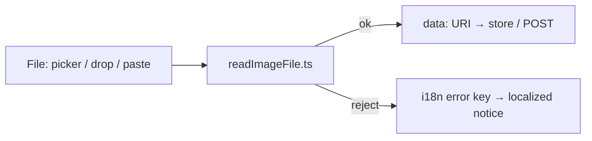

# readImageFile.ts — AI component doc

> AI-facing sidecar for `shared/libs/readImageFile.ts`. Moved here from `modules/Generator/model/` on 2026-07-22. Keep this in sync with the code on every change.

## Purpose
The single client-side gate that validates and reads any user-attached image into
a data URI. It lives in `shared/` so every module that accepts an image — the
Generator composer and the Cinema shot references — shares ONE type/size check
and the caps can never drift onto the wire.

## What it does (for an AI reader)
- Responsibilities:
  - Reject non-image files (`file.type` must start with `image/`).
  - Reject files over `MAX_FILE_BYTES` (10MB) — base64 inflates ~4/3, staying
    under the contracts wire cap of 14MB for the reference data-URI channel.
  - Read an accepted file to a `data:` URI via `FileReader.readAsDataURL`.
- Public API / exports:
  - `MAX_FILE_BYTES` — the 10MB file ceiling.
  - `ReadImageError` — the two i18n error KEYS (`generator.image.errors.type|size`).
  - `ReadImageResult` — `{ ok: true; dataUri } | { ok: false; errorKey }`.
  - `readImageFile(file): Promise<ReadImageResult>`.
- Inputs → Outputs: a browser `File` → a discriminated result (data URI or an
  i18n error key). Errors are KEYS, never rendered strings, so a language switch
  re-localizes an on-screen error.
- Side effects: none beyond the in-memory `FileReader` read (no network, no store).

## Dependencies
- Imports / depends on: browser `FileReader` only. No module/app imports (it is
  domain-agnostic, as `shared/` requires).
- Used by:
  - `modules/Generator/components/AttachImage.tsx` (composer paperclip chip).
  - `modules/Generator/components/ImageDrop.tsx` (sheet dropzone).
  - `modules/Generator/components/ChatComposer.tsx` (paste + drag-drop onto the composer).
  - `modules/Cinema/components/ShotReferenceImages.tsx` (attach any image to a shot).

## Diagram

## Key decisions / gotchas
- Moved from `Generator/model/` to `shared/libs/` because Cinema needs the same
  gate and `modules/Cinema` may not import from `modules/Generator` (cross-module
  law). Copying it into Cinema would fork the caps — the exact drift this file
  exists to prevent — so promotion to `shared/` was the correct home.
- The error keys stay in the `generator.*` i18n namespace they were minted in.
  Re-namespacing would touch every unrelated call site (Assets3D/Entities also
  reference `generator.image.errors.size` as a string) for no behavioral gain.
- SVG is NOT filtered here — `image/svg+xml` passes the `image/` prefix check.
  The svg-XSS guard lives at the API boundary (contracts `addShotReferenceInput`
  and `parseImageDataUri`), which is where a stored-and-served script must be
  refused. This gate is only about type-family + size for a clean UX.

## Commits
- _no commit yet_
