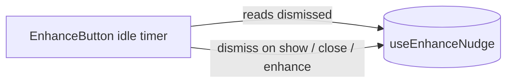

# enhanceNudge.ts — AI component doc

> AI-facing sidecar for `enhanceNudge.ts`. Created 2026-07-21. Keep this in sync with the code on every change.

## Purpose
A one-per-session flag that stops the enhance nudge tooltip from ever arming twice.
A tiny Zustand singleton so the "already seen it" decision is SHARED across both
prompt surfaces and every route in the SPA session.

## What it does (for an AI reader)
- Responsibilities: hold `dismissed` and expose `dismiss()`. Nothing else — no timers,
  no DOM; the timing/idle logic lives in `EnhanceButton`.
- Public API / exports / props / endpoints: `useEnhanceNudge` (Zustand store),
  `EnhanceNudgeState` type. State: `{ dismissed: boolean; dismiss(): void }`.
- Inputs → Outputs: `dismiss()` sets `dismissed = true` (idempotent); consumers read
  `dismissed` to decide whether to arm the idle timer.
- Side effects (I/O, network, state): in-memory module singleton; resets on full reload.

## Dependencies
- Imports / depends on: `zustand` (`create`).
- Used by: `shared/ui/EnhanceButton.tsx` (via the `shared/model` barrel);
  tests reset it with `useEnhanceNudge.setState({ dismissed: false })`.

## Diagram

## Key decisions / gotchas
- Zustand over `sessionStorage`: deterministic to reset in tests and it already matches
  the app's client-state convention (`generatorStore`, `wizardStore`, `viewSettings`).
- Showing the hint ALSO calls `dismiss()` — "at most once" means one appearance, not one
  per idle pause, so arming is disabled the instant it shows.

## Commits
- _no commit yet_
