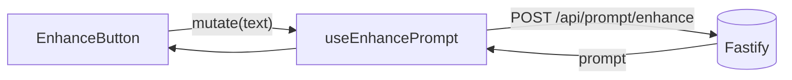

# enhancePrompt.ts — AI component doc

> AI-facing sidecar for `enhancePrompt.ts`. Created 2026-07-21. Keep this in sync with the code on every change.

## Purpose
The shared TanStack Query mutation behind the prompt-enhancer affordance: it POSTs
a rough draft to `/api/prompt/enhance` (mode `enhance`) and hands back one detailed
cinematic prompt. It lives in `shared/` so both the /create composer and the Cinema
shot prompt can drive the same free, stateless text transform without a cross-module import.

## What it does (for an AI reader)
- Responsibilities: own the wire call for the ENHANCE rewrite mode only (the `soften`
  content_blocked-retry variant is a separate concern). No copy mapping, no UI.
- Public API / exports / props / endpoints: `useEnhancePrompt()` → a
  `UseMutationResult<PromptEnhanceResult, unknown, string>`; endpoint `POST /api/prompt/enhance`.
- Inputs → Outputs: `mutate(text: string)` → request body `{ text, mode: 'enhance' }`
  → `{ prompt: string }` on success; a non-2xx becomes `ApiClientError` (code drives the
  call-site copy: `provider_error` 502 → "unavailable", `rate_limited` 429, else generic).
- Side effects (I/O, network, state): one `fetch` via `api()`; no cache writes (the
  enhanced prompt is handed to the caller, never persisted server-side).

## Dependencies
- Imports / depends on: `@tanstack/react-query` (`useMutation`), `shared/libs/apiClient`
  (`api`), `@opencreate/contracts` (`PromptEnhanceResult` type).
- Used by: `shared/ui/EnhanceButton.tsx` (via the `shared/model` barrel).

## Diagram

## Key decisions / gotchas
- The error type is `unknown` (not `Error`) so the call site narrows to `ApiClientError`
  itself — this hook stays domain-agnostic and maps no codes.
- No `onSuccess` cache write: unlike `useCreateGeneration`, an enhanced prompt is a draft
  suggestion, not a persisted entity; the caller decides whether to replace the field.

## Commits
- _no commit yet_
