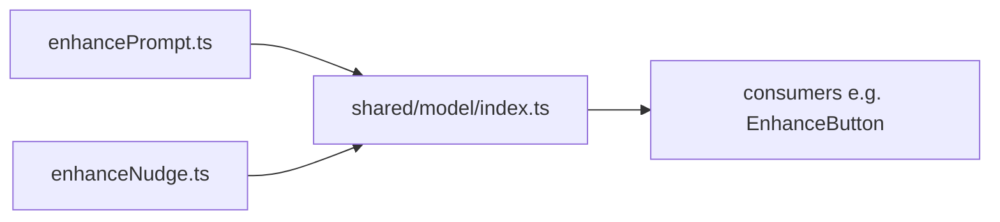

# index.ts — AI component doc

> AI-facing sidecar for `index.ts`. Created 2026-07-21. Keep this in sync with the code on every change.

## Purpose
Public API barrel of `shared/model` — the domain-agnostic data/state layer more than
one module drives. Consumers import from `'shared/model'`, never the individual files.

## What it does (for an AI reader)
- Responsibilities: re-export the shared hooks/stores and their public types.
- Public API / exports / props / endpoints: `useEnhancePrompt`, `useEnhanceNudge`,
  type `EnhanceNudgeState`.
- Inputs → Outputs: none (pure re-export surface).
- Side effects (I/O, network, state): none.

## Dependencies
- Imports / depends on: `./enhancePrompt`, `./enhanceNudge`.
- Used by: `shared/ui/EnhanceButton.tsx`; any future surface needing the enhance layer.

## Diagram

## Key decisions / gotchas
- First file under `shared/model` — the standard's `shared/{config,libs,model,types,ui}`
  layout; a React hook + a client store belong in `model`, not `libs` (pure utilities).

## Commits
- _no commit yet_
