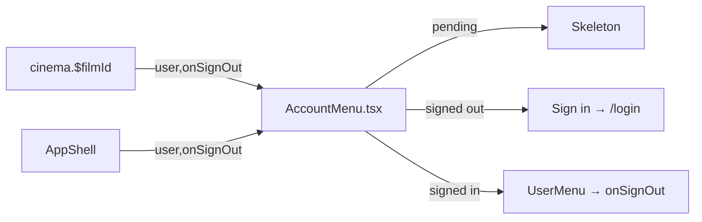

# AccountMenu.tsx — AI component doc

> AI-facing sidecar for `AccountMenu.tsx`. Created 2026-07-22. Keep this in sync with the code on every change.

## Purpose
The header's right-most **account slot**, extracted out of `AppShell` so more than one top bar
(the global `AppShell` AND the CinemaStudio editor's own `CinemaEditorHeader`) can render the
same account affordance without one importing the other. Presentational only.

## What it does (for an AI reader)
- Responsibilities: render exactly one of three states — session-pending skeleton, signed-out
  "Sign in" pill, signed-in disclosure menu — and fire `onSignOut` from the menu.
- Public API / exports / props / endpoints: `AccountMenu({ user, isSessionPending?, onSignOut })`;
  types `AccountUser` ({ name: string | null; email: string }) and `AccountMenuProps`.
- Inputs → Outputs: `isSessionPending` → `Skeleton`; `user === null` → RED specimen `Link` to
  `/login`; `user` present → `UserMenu` (private, disclosure button + one Sign out item).
- Side effects (I/O, network, state): none beyond calling `onSignOut`. Local `isOpen` state only.

## Dependencies
- Imports / depends on: `@tanstack/react-router` (`Link`), `react-i18next`, `./Skeleton`.
- Used by: `shared/ui/AppShell.tsx`; `routes/cinema.$filmId.tsx` (composed into the `chrome`
  slot). Re-exported from `shared/ui/index.ts`.

## Diagram

## Key decisions / gotchas
- `AccountUser` lives HERE, not in `AppShell`, to avoid a circular type import — `AppShell`
  re-exports it as `AppShellUser` for backward compatibility.
- Architecture law: presentational, no `modules/*` imports; the composing route injects session
  state + `onSignOut`.

## Commits
- _no commit yet_
