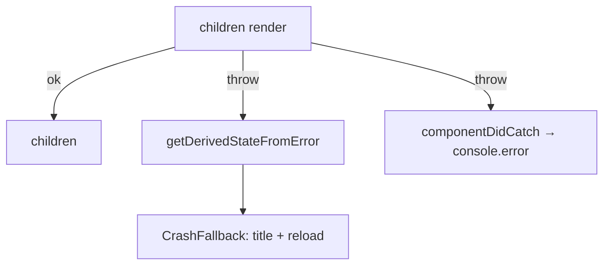

# AppErrorBoundary.tsx — AI component doc

> AI-facing sidecar for `AppErrorBoundary.tsx`. Created 2026-07-06. Keep this in sync with the code on every change.

## Purpose
Root crash fallback — the frontend-error-ux contract's error boundary. Catches any render error below it and swaps the broken tree for a calm full-screen "technical update" screen with a reload button, so the user never sees a white screen or a stack trace.

## What it does (for an AI reader)
- Responsibilities: class component (the only React mechanism that catches render errors) with `getDerivedStateFromError` → `hasError: true`; `componentDidCatch` logs raw detail to the console (monitoring hook point); renders `CrashFallback` (function child, so it can use the `useTranslation` hook) or `children`.
- Public API / exports / props / endpoints: `AppErrorBoundary` with `children: ReactNode`.
- Inputs → Outputs: healthy children → children; thrown render error → full-screen fallback (`errors.crash.*` copy + primary reload `Button`).
- Side effects (I/O, network, state): `console.error` on catch; `window.location.reload()` on the fallback button.

## Dependencies
- Imports / depends on: `react` (`Component`), `react-i18next`, `shared/ui/Button`.
- Used by: `routes/__root.tsx` — wraps the providers (outermost), so even a provider crash still shows the fallback; exported through `shared/ui/index.ts`.

## Diagram

## Key decisions / gotchas
- The fallback is a terminal state by design — no reset/retry of the tree; a render crash means unknown app state, and a full reload is the only honest recovery.
- User-safe copy only ("technical update", no blame, no codes) per design.md §8; raw error stays in the console.
- Sits OUTSIDE `QueryClientProvider` in the root route, so the fallback must not depend on query/router context (it doesn't — only i18next's global instance).

## Commits
- 51d80a6 2026-07-06 feat(web): paper&ink design system, shared ui kit, error-ux surfaces
