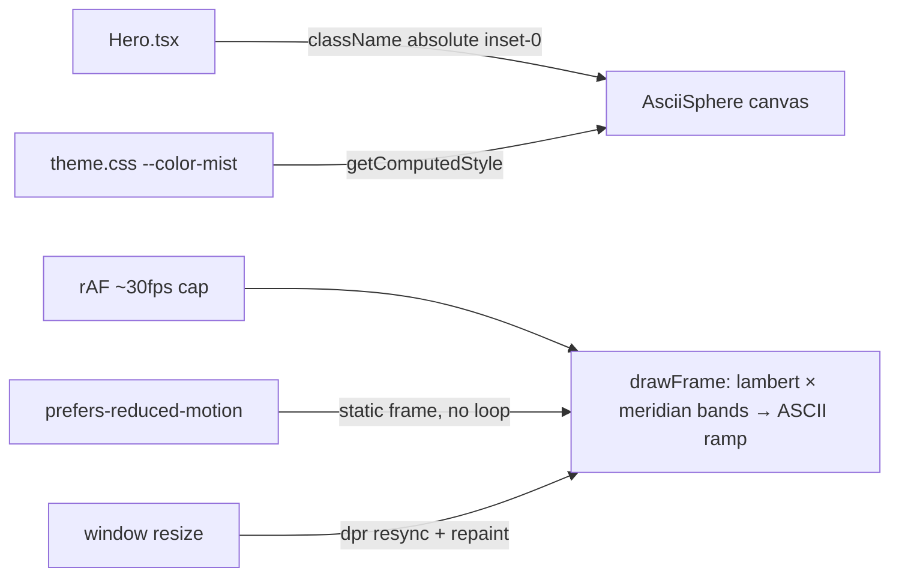

# AsciiSphere.tsx — AI component doc

> AI-facing sidecar for `AsciiSphere.tsx`. Created 2026-07-07 (Stage 2 terminal
> landing). Keep this in sync with the code on every change.

## Purpose
The v3 "Bioluminescent Terminal" hero visual: a dependency-free animated ASCII
ellipsoid on a `<canvas>` 2d context. Mist-colored (`--color-mist`) glyphs at
low opacity (0.34) on a TRANSPARENT background — no WebGL, no libraries, no
gradients (hard owner rule). The hero copy overlays it; the sphere is pure
atmosphere.

## What it does (for an AI reader)
- Responsibilities: sample a character grid over an ellipsoid cross-section;
  per cell compute lambert shading × slowly rotating meridian bands; map shade
  to the ASCII density ramp `' .:-=+*#%@'` and `fillText` the glyph. Rotation
  is what makes the spin visible — pure lambert on a sphere is
  rotation-invariant, hence the longitude-band modulation.
- Public API / exports: `AsciiSphere`, `AsciiSphereProps`
  (`className?: string` — caller sizes/places the canvas, e.g. `absolute inset-0`).
- Inputs → Outputs: none at runtime (self-driven) → an aria-hidden canvas that
  paints itself.
- Side effects (all inside one mount effect, all cleaned up):
  - `~30fps` rAF loop — rAF fires at display rate, frames within the 33ms
    budget are skipped; `cancelAnimationFrame` on unmount.
  - `window resize` listener — re-syncs the backing store (devicePixelRatio
    aware via `setTransform`) and repaints; removed on unmount.
  - `prefers-reduced-motion: reduce` → ONE static frame (fixed rotation
    `staticT`), no loop ever starts.
  - No 2d context (jsdom/unsupported) → renders an inert transparent box.
- Color: resolved from the live theme via
  `getComputedStyle(canvas).getPropertyValue('--color-mist')` with the
  `#cad5e2` fallback mirroring the token — the canvas can't consume `var()`
  in `fillStyle`, so this is the sanctioned bridge to the token system.

## Dependencies
- Imports / depends on: `react` (`useEffect`, `useRef`) only — dependency-free
  by design (spec requirement).
- Used by: `modules/Landing/components/Hero.tsx` (full-viewport hero backdrop),
  exported through `shared/ui/index.ts`.

## Diagram

## Key decisions / gotchas
- **Frame cap, not throttled setInterval**: rAF keeps the loop tab-friendly
  (paused when hidden); the 33ms budget drops frames instead of re-timing them.
- **First frame is synchronous** so the hero never flashes an empty canvas
  before the first rAF tick.
- **`RAMP.charAt(i)`** instead of `RAMP[i]` — indexing returns
  `string | undefined` under `noUncheckedIndexedAccess`.
- **The darkest cells map to the space glyph and are skipped** — the sphere
  dissolves into the void instead of ending at a hard rim.
- Tests drive rAF manually (queued callbacks + explicit timestamps) and stub a
  minimal structural subset of `CanvasRenderingContext2D`.

## Commits
- (pending) restyle(web): terminal landing with ascii-sphere hero + pricing
