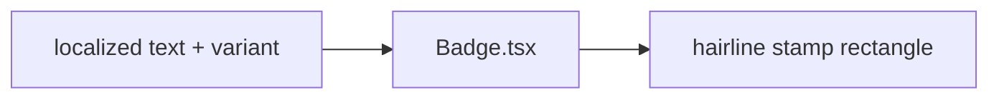

# Badge.tsx — AI component doc

> AI-facing sidecar for `Badge.tsx`. Created 2026-07-06. Keep this in sync with the code on every change.

## Purpose
Stamp-style status badge of the "Light Editorial" kit: an uppercase, letter-spaced, hairline-outlined rectangle — an ink stamp on paper (replaced the v1 tinted pill).

## What it does (for an AI reader)
- Responsibilities: render a small static status marker with a variant-colored outline + lettering.
- Public API / exports / props / endpoints: `Badge`, `BadgeProps` = `{ children: ReactNode; variant?: 'neutral' | 'accent' | 'success' | 'danger' }` (default neutral), `BadgeVariant`.
- Inputs → Outputs: localized text + variant → `` stamp (`rounded-[3px] border uppercase tracking-[0.14em] text-[11px]`).
- Side effects: none.

## Dependencies
- Imports / depends on: React types; tokens via utilities (`border-ink/30`, `border-vermillion/70`, `border-success/60`, `border-danger/60`).
- Used by: Gallery failed cards ("Credits refunded" success stamp); pricing "200 free credits" stamp (stage 2); any status marker.

## Diagram

## Key decisions / gotchas
- Outline carries the variant, never a solid fill — a stamp is border + lettering. Corners are `rounded-[3px]` (stamp-crisp), not pill-round.
- Uppercase is CSS-only (`text-transform`): DOM text / i18n strings queried by tests remain untouched.
- The `accent` (vermillion) stamp at 11px is a brief-sanctioned vermillion-text exception ("small stamps/badges") recorded in design.md §7 — do not extend vermillion to other small text.
- Status is never color-only — the badge TEXT carries the meaning (a11y rule §7).

## Commits
- 51d80a6 2026-07-06 feat(web): paper&ink design system, shared ui kit, error-ux surfaces
- 3305c12 2026-07-07 restyle(web): editorial design system — tokens, fonts, ui kit
