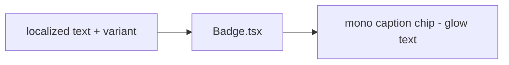

# Badge.tsx — AI component doc

> AI-facing sidecar for `Badge.tsx`. Created 2026-07-06. Keep this in sync with the code on every change.

## Purpose
Status badge of the v3 "Bioluminescent Terminal" kit: a quiet MONO CAPTION CHIP — a small translucent pill (white/5 wash, white/10 hairline) with lowercase 12px mono text colored by the triad glows.

## What it does (for an AI reader)
- Responsibilities: render a small static status marker; variant picks the glow text color over a shared chip body.
- Public API / exports / props / endpoints: `Badge`, `BadgeProps` = `{ children: ReactNode; variant?: 'neutral' | 'accent' | 'success' | 'danger' }` (default neutral), `BadgeVariant`.
- Inputs → Outputs: localized text + variant → `` chip (`rounded-full border-white/10 bg-white/5 text-xs` + glow text).
- Side effects: none.

## Dependencies
- Imports / depends on: React types; tokens via utilities (`text-mist-dim`, `text-glow-amber`, `text-glow-green`, `text-glow-red`, `border-white/10`).
- Used by: Gallery failed cards ("Credits refunded" success chip); pricing "200 free credits" accent chip; landing showcase "sample style" label; any status marker.

## Diagram

## Key decisions / gotchas
- v3 restyle intent: the v2 uppercase "ink stamp" made sense on paper; on the void the badge becomes a lowercase mono caption chip — the terminal voice never shouts, so the uppercase/tracking treatment is gone entirely (not just visually).
- Variant → triad mapping (design.md v3 §2): accent = glow-amber (explore/tier), success = glow-green, danger = glow-red, neutral = mist-dim. Same closed triad as buttons and generation statuses (processing=amber / succeeded=green / failed=red).
- Translucent chip body (white/5 + white/10 hairline) reads on every surface step; solid fills stay banned.
- Status is never color-only — the badge TEXT carries the meaning (a11y rule §7).

## Commits
- 51d80a6 2026-07-06 feat(web): paper&ink design system, shared ui kit, error-ux surfaces
- 3305c12 2026-07-07 restyle(web): editorial design system — tokens, fonts, ui kit
- 252ab38 2026-07-07 restyle(web): terminal design system — cosmic void tokens, jetbrains mono, specimen pills + docs
