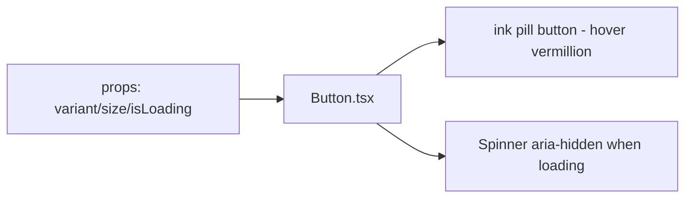

# Button.tsx — AI component doc

> AI-facing sidecar for `Button.tsx`. Created 2026-07-06. Keep this in sync with the code on every change.

## Purpose
The design-system button of the "Light Editorial" kit: a solid-ink pill whose hover flips to vermillion (the editorial CTA gesture), with quiet hairline `ghost` and destructive `danger` variants.

## What it does (for an AI reader)
- Responsibilities: render an accessible `<button>` with variant/size styling, loading spinner + `aria-busy`, disabled handling (loading always disables — no double submits).
- Public API / exports / props / endpoints: `Button`, `ButtonProps` (`children`, `variant: 'primary' | 'ghost' | 'danger'` default primary, `size: 'md' | 'lg'` default md, `isLoading`, plus all native button attributes), `ButtonVariant`, `ButtonSize`.
- Inputs → Outputs: props → styled `<button>`; `isLoading` → spinner (`data-testid="button-spinner"`, aria-hidden) + disabled + `aria-busy`.
- Side effects: none.

## Dependencies
- Imports / depends on: React types only; tokens via Tailwind utilities (`bg-ink`, `text-cream`, `hover:bg-vermillion`, `bg-sand`, `bg-danger`, `ring-vermillion`).
- Used by: shared/ui (ErrorState, AppErrorBoundary fallback), modules (Auth, Generator, Gallery, Credits) — everywhere a real `<button>` is needed. Links that must LOOK like the primary button mirror its classes (NotFoundPage, AppShell sign-in, Hero/pricing CTAs).

## Diagram

## Key decisions / gotchas
- v2 editorial restyle: primary = `bg-ink text-cream hover:bg-vermillion` `rounded-full`; ghost = hairline outline (`border-ink/25`, hover solidifies border + sand wash); danger stays a SOLID fill in the deeper danger red (#b3261e) so destructive actions never read as the vermillion accent.
- Hover uses `transition-colors duration-200` (brief: hovers must be felt; motion window 150–250ms). Focus = vermillion ring with cream offset.
- Loading state is also disabled and exposes `aria-busy`; the spinner is decorative (`aria-hidden`).
- Tests (`Button.test.tsx`) are behavior-only: label/click, loading disables + spinner, idle has no spinner — restyles must keep them green.

## Commits
- 51d80a6 2026-07-06 feat(web): paper&ink design system, shared ui kit, error-ux surfaces
- (pending) restyle(web): editorial design system — tokens, fonts, ui kit
