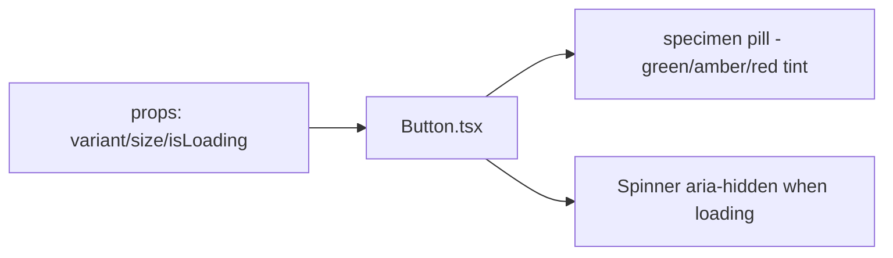

# Button.tsx — AI component doc

> AI-facing sidecar for `Button.tsx`. Created 2026-07-06. Keep this in sync with the code on every change.

## Purpose
The design-system button of the v3 "Bioluminescent Terminal" kit: a translucent specimen pill from the closed triad — green (primary/create), amber (ghost/explore), red (danger/destructive) — never a solid opaque fill.

## What it does (for an AI reader)
- Responsibilities: render an accessible `<button>` with triad/size styling, loading spinner + `aria-busy`, disabled handling (loading always disables — no double submits).
- Public API / exports / props / endpoints: `Button`, `ButtonProps` (`children`, `variant: 'primary' | 'ghost' | 'danger'` default primary, `size: 'md' | 'lg'` default md, `isLoading`, plus all native button attributes), `ButtonVariant`, `ButtonSize`.
- Inputs → Outputs: props → styled `<button>`; `isLoading` → spinner (`data-testid="button-spinner"`, aria-hidden) + disabled + `aria-busy`.
- Side effects: none.

## Dependencies
- Imports / depends on: React types only; tokens via Tailwind utilities (`bg-specimen-green/20`, `text-glow-green`, `bg-specimen-amber/20`, `text-lumen-amber`, `bg-specimen-red/20`, `text-lumen-red`, `border-white/10`, `shadow-pill`, `ring-portal`).
- Used by: shared/ui (ErrorState, AppErrorBoundary fallback), modules (Auth, Generator, Gallery, Credits) — everywhere a real `<button>` is needed. Links that must LOOK like a specimen pill mirror its classes (NotFoundPage, AppShell sign-in, Hero/pricing CTAs).

## Diagram

## Key decisions / gotchas
- v3 terminal restyle: every variant = translucent `/20` tint + `border-white/10` + bright triad text + `shadow-pill` (the ONE allowed shadow — soft double). Hover deepens the same tint to `/35` — a pill glows brighter, it never changes color or goes solid (reference "no solid opaque CTA fills" law).
- Triad semantics (design.md v3 §2): primary=green → create/submit; ghost=amber → explore/browse/secondary; danger=red → destructive/auth-exit. Max three button tints, closed system.
- `font-medium` (500) is the weight ceiling app-wide; focus ring is portal blue (`ring-portal`), no ring offset (offsets against varying surfaces caused halo mismatches on the void).
- Loading state is also disabled and exposes `aria-busy`; the spinner is decorative (`aria-hidden`).
- Tests (`Button.test.tsx`) are behavior-only: label/click, loading disables + spinner, idle has no spinner — restyles must keep them green.

## Commits
- 51d80a6 2026-07-06 feat(web): paper&ink design system, shared ui kit, error-ux surfaces
- 3305c12 2026-07-07 restyle(web): editorial design system — tokens, fonts, ui kit
- 252ab38 2026-07-07 restyle(web): terminal design system — cosmic void tokens, jetbrains mono, specimen pills + docs
