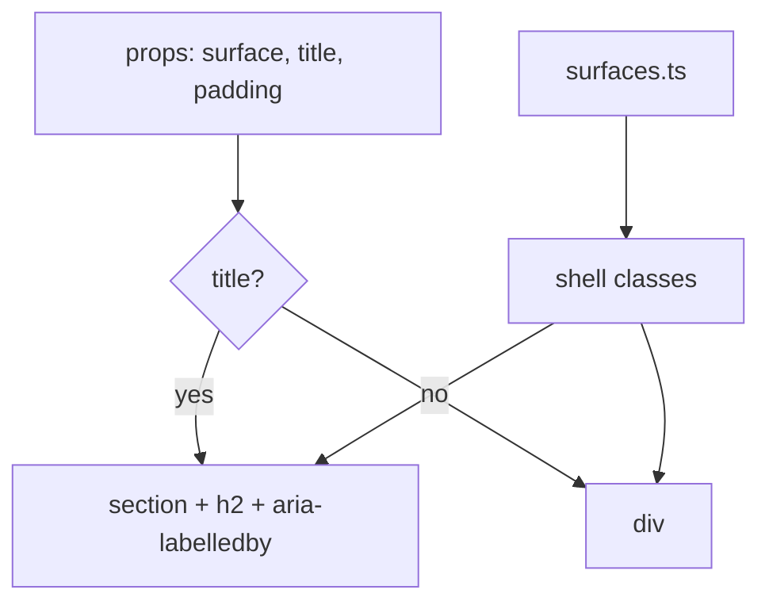

# Card.tsx — AI component doc

> AI-facing sidecar for `Card.tsx`. Created 2026-07-09. Keep this in sync with the code on every change.

## Purpose
The v4 surface primitive. Every panel in the app is a `Card` with a DECLARED surface and padding,
replacing the ~55 hand-rolled `rounded-lg border border-white/10 p-4` strings that made a video
player, an export button and a track list read with identical visual weight.

## What it does (for an AI reader)
- Responsibilities: render a panel at the right depth; give a titled panel an accessible landmark.
- Public API / props:
  - `children: ReactNode` — card body.
  - `surface?: 'glass' | 'steel' | 'well'` (default `glass`) — depth; strings come from `surfaces.ts`.
  - `title?: string` — when present the card renders as `<section aria-labelledby>` with a visible
    weight-400 mono heading. Screen-reader users navigate the editor by these regions.
  - `action?: ReactNode` — trailing control on the heading row (only meaningful with `title`).
  - `padding?: 'none' | 'md' | 'lg'` (default `md`) — `none` for edge-to-edge media.
  - `className?: string` — LAYOUT ONLY (grid span, sticky). Never surface styling.
- Inputs → Outputs: props → a `
` (untitled) or `<section>` (titled).
- Side effects: none. `useId` associates the heading with the section.

## Dependencies
- Imports / depends on: `react` (`useId`, `ReactNode`), `./surfaces`.
- Used by: `modules/Cinema/*`, `modules/Gallery/*`, `modules/Generator/*`, `modules/Entities/*`,
  `modules/Landing/*`. Exported from `shared/ui/index.ts`. Tested by `Card.test.tsx`.

## Diagram

## Key decisions / gotchas
- `rounded-2xl` (16px) — the glass silhouette, and already what `Modal`'s sheet uses. A card and a
  sheet are the same material, so they share the radius.
- A titled card is a **labelled landmark**, not decoration: `title` drives `aria-labelledby`.
- `className` exists for grid/sticky only. Surface styling through it is a design-system violation.
  `Card.test.tsx` pins the glass readability invariant (the opaque `bg-steel` baseline must survive).
- Media plates use `surface="well" padding="none"`: media is the hero, chrome must not bury it.

## Commits
- _no commit yet_
