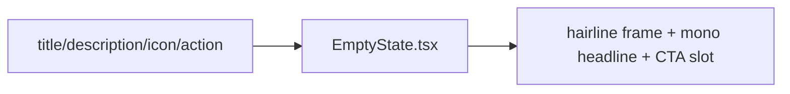

# EmptyState.tsx — AI component doc

> AI-facing sidecar for `EmptyState.tsx`. Created 2026-07-06. Keep this in sync with the code on every change.

## Purpose
Empty-state placeholder of the v3 "Bioluminescent Terminal" kit (4-states rule: a data surface with no items must explain itself and offer a next action — never a blank screen). A white/10 hairline frame directly on the void with a mono weight-400 headline.

## What it does (for an AI reader)
- Responsibilities: static placeholder layout — optional decorative icon, mono title, optional description and action slot.
- Public API / exports / props / endpoints: `EmptyState`, `EmptyStateProps` = `{ icon?: ReactNode; title: string; description?: string | undefined; action?: ReactNode }`.
- Inputs → Outputs: localized strings + optional action node → centered hairline frame.
- Side effects: none.

## Dependencies
- Imports / depends on: React types; tokens via utilities (`border-white/10`, `text-white`, `text-mist-dim`, `rounded-lg`).
- Used by: Gallery (no generations yet + `/create` CTA), Generator (defensive empty catalog), Credits TransactionsList (no history), pricing route (defensive empty table).

## Diagram

## Key decisions / gotchas
- v3 restyle intent: emptiness sits directly on the void inside a `border-white/10` `rounded-lg` frame (the reference law "body prose sits on the void, not in cards" applies to placeholders too); the title is the standard v3 heading — `text-3xl font-normal text-white` (mono 30px weight 400, never bold, no uppercase). Behavior/props unchanged.
- The icon is decorative (`aria-hidden`); meaning lives in the title/description text.

## Commits
- 51d80a6 2026-07-06 feat(web): paper&ink design system, shared ui kit, error-ux surfaces
- 3305c12 2026-07-07 restyle(web): editorial design system — tokens, fonts, ui kit
- 252ab38 2026-07-07 restyle(web): terminal design system — cosmic void tokens, jetbrains mono, specimen pills + docs
