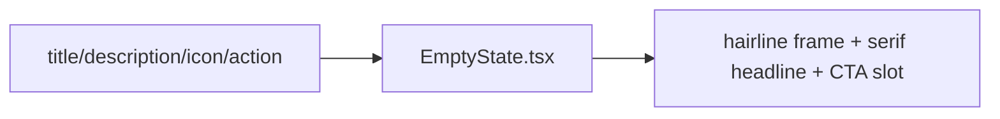

# EmptyState.tsx — AI component doc

> AI-facing sidecar for `EmptyState.tsx`. Created 2026-07-06. Keep this in sync with the code on every change.

## Purpose
Empty-state placeholder of the "Light Editorial" kit (4-states rule: a data surface with no items must explain itself and offer a next action — never a blank screen). A hairline-ruled frame directly on the cream canvas with a serif headline.

## What it does (for an AI reader)
- Responsibilities: static placeholder layout — optional decorative icon, serif title, optional description and action slot.
- Public API / exports / props / endpoints: `EmptyState`, `EmptyStateProps` = `{ icon?: ReactNode; title: string; description?: string | undefined; action?: ReactNode }`.
- Inputs → Outputs: localized strings + optional action node → centered hairline frame.
- Side effects: none.

## Dependencies
- Imports / depends on: React types; tokens via utilities (`border-ink/15`, `font-display`, `text-ink-soft`).
- Used by: Gallery (no generations yet + `/create` CTA), Generator (defensive empty catalog), Credits TransactionsList (no history), pricing route (defensive empty table).

## Diagram

## Key decisions / gotchas
- v2 restyle: dropped the raised white card (`rounded-2xl bg-white`) — emptiness sits on the paper itself inside a hairline `border-ink/15` frame; title moved to Fraunces (`font-display text-2xl`). Behavior/props unchanged.
- The icon is decorative (`aria-hidden`); meaning lives in the title/description text.

## Commits
- 51d80a6 2026-07-06 feat(web): paper&ink design system, shared ui kit, error-ux surfaces
- (pending) restyle(web): editorial design system — tokens, fonts, ui kit
